# Attack Surface Reduction

[Attack Surface Reduction (ASR)](https://docs.microsoft.com/en-us/microsoft-365/security/defender-endpoint/overview-attack-surface-reduction?view=o365-worldwide) is a Microsoft feature to *Reduce vulnerabilities (attack surfaces) in your applications with intelligent rules that help stop malware*.

This repository tries to describe what the rules are and what they actually check.
This is likely incomplete, and only limited to the author's understanding of ASR.

Note: A few ASR bypasses are already known (as the ones from [Emeric Nasi from SEVAGAS](https://blog.sevagas.com/IMG/pdf/bypass_windows_defender_attack_surface_reduction.pdf) or [this gist from infosecn1nja](https://gist.github.com/infosecn1nja/24a733c5b3f0e5a8b6f0ca2cf75967e3)). Still, one could argue that these rules might be a good way to limit low-level, widespread attack attempts.

## Finding ASR rules implementation

### Targeting the right binary

As the [overview](https://docs.microsoft.com/en-us/microsoft-365/security/defender-endpoint/overview-attack-surface-reduction?view=o365-worldwide) page says:

>  (Requires Microsoft Defender Antivirus)

Another hint can be found in the [FAQ](https://docs.microsoft.com/en-us/microsoft-365/security/defender-endpoint/attack-surface-reduction-faq?view=o365-worldwide):

> ASR was ....  introduced as a major update to Microsoft Defender Antivirus

It looks like ASR rules are implemented and enforced by Windows Defender.

Rules are configured through the following registry key: `HKLM\Software\Policies\Microsoft\Windows Defender\Windows Defender Exploit Guard\ASR\Rules`.

For instance, to enable the *Use advanced protection against ransomware* rule (GUID `c1db55ab-c21a-4637-bb3f-a12568109d35`), one adds a registry value `c1db55ab-c21a-4637-bb3f-a12568109d35` set to `1`, to the aforementioned registry key.

As expected, on `Windows Defender Service` start, `MsMpEng` (the Windows Defender engine) reads the registry key:
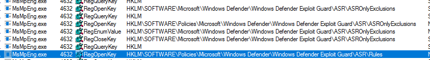

### Looking for our GUIDs

Windows Defender is made of several components, including:

* WdFilter, the filter driver ([here](https://www.n4r1b.com/posts/2020/01/dissecting-the-windows-defender-driver-wdfilter-part-1/) is a good ressource about it)
* WdBoot, the ELAM part
* `MpSvc.dll`, `MpClient.dll`, `MpCmdRun.exe`: interfaces with the engine
* `mpengine.dll`: the actual engine implementation
* `mpasbase.vdm`, `mpavbase.vdm`: engine ressources (signatures, emulation ressources, etc.)

As the rules [are referenced with GUID](https://docs.microsoft.com/en-us/microsoft-365/security/defender-endpoint/attack-surface-reduction?view=o365-worldwide#attack-surface-reduction-rules), they can be looked for in these binaries. Unfortunately, this naive approach does not yield any result.

But we can look further in the VDM files. Their contents can be retrieved using [WDExtract](https://github.com/hfiref0x/WDExtract).

Looking for one of the GUID (`be9ba2d9-53ea-4cdc-84e5-9b1eeee46550`), we have a hit in `mpasbase.vdm.extracted`, more specifically in the DLL `module1025.dll`:

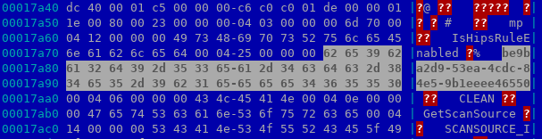

Looking above:

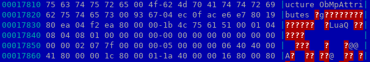

`1B 4C 75 61` is the signature of a precompiled Lua script. The next byte, `51` indicates the Lua engine version (5.1).

So, it seems that at least a part of ASR is written using the Lua engine of MpEngine.

## Investigating the LUA engine

The Lua engine is able to call functions implemented in the MpEngine DLL. For instance, the `IsHipsRuleEnabled` that we saw above is implemented as:

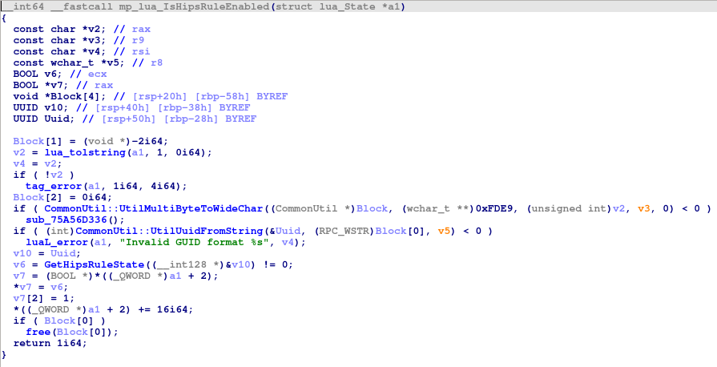

Let's try to break on this function to ensure it is actually reached.

To debug Windows Defender, we'll need two things:
* It's a PPL process. We can remove this protection using Mimikatz:
```sh
mimikatz # !+
[*] 'mimidrv' service not present
[+] 'mimidrv' service successfully registered
[+] 'mimidrv' service ACL to everyone
[+] 'mimidrv' service started

mimikatz # !processprotect /process:msMpEng.exe /remove
Process : msMpEng.exe
PID 1936 -> 00/00 [0-0-0]
```
* The driver part registers a `ObRegisterCallback` to [defend itself against memory reads/writes from other processes](https://www.n4r1b.com/posts/2020/03/dissecting-the-windows-defender-driver-wdfilter-part-3/). One way to remove it is to attach a kernel debugger to our target system and "NOP" the function:
```
kd> a WdFilter!MpObPreOperationCallback
fffff801`beb3ef40 xor eax,eax
fffff801`beb3ef42 ret
fffff801`beb3ef43
```

(This method is also documented [here](https://qiita.com/msmania/items/19547606b9c197c64d70) and [here](https://github.com/Mattiwatti/PPLKiller/pull/6#issuecomment-346198366), and on some cheating forums :) )

Now we can set a breakpoint on `IsHipsRuleEnabled`. Upon manually scanning a file, our breakpoint is reached; looking at the call stack, it indeed comes from the Lua interpretor, especially the `luaD_precall` and `luaD_call` functions.

### Decompiling the scripts

Let's extract the script starting at `\x1bLua`.
Trying to decompile it using standard tools as [luadec](https://github.com/viruscamp/luadec) unfortunately fails on:
```
out.1.luac: bad header in precompiled chunk
```

Still, the project works on sample scripts compiled with `lua-5.1`.

Digging into the format, according to [A No-Frills Introduction to Lua 5.1 VM Instructions](http://luaforge.net/docman/83/98/ANoFrillsIntroToLua51VMInstructions.pdf) ([mirror](http://underpop.free.fr/l/lua/docs/a-no-frills-introduction-to-lua-5.1-vm-instructions.pdf)), the difference seems to be in the header and data structure sizes.

Using a [naive script](https://github.com/commial/experiments/tree/master/windows-defender/lua), one can convert the Lua from VDM files into a precompiled script that `luadec` can deal with.

As a result, we obtain:
```lua
-- params : ...
-- function num : 0
local l_0_0 = function(l_1_0, l_1_1)
  -- function num : 0_0
  local l_1_2 = {}
  l_1_2[1952539182] = ""
  l_1_2[1684890414] = ""
  l_1_2[1836016430] = ""
  l_1_2[1819304750] = ""
  l_1_2[1702389038] = ""
  l_1_2[1718186030] = ""
  l_1_2[1919120174] = ""
  l_1_2[1935832622] = ""
  l_1_2[1802398766] = ""
  l_1_2[1718843182] = ""
  l_1_2[1700951598] = ""
  l_1_2[1702062638] = ""
  l_1_2[1635018798] = ""
  l_1_2[1936338432] = ""
  l_1_2[1819042862] = ""
  l_1_2[2019782446] = ""
  l_1_2[1918986798] = ""
  l_1_2[1668511534] = ""
  l_1_2[1752397614] = ""
  local l_1_3 = (mp.bitor)((mp.readu_u32)(l_1_0, l_1_1), 538976288)
  if l_1_2[l_1_3] or l_1_2[(mp.bitand)(l_1_3, 4294967040)] then
    return true
  end
  return false
end

if not (mp.IsHipsRuleEnabled)("be9ba2d9-53ea-4cdc-84e5-9b1eeee46550") then
  return mp.CLEAN
end
if (mp.get_contextdata)(mp.CONTEXT_DATA_SCANREASON) ~= mp.SCANREASON_ONMODIFIEDHANDLECLOSE then
  return mp.CLEAN
end
if (mp.get_contextdata)(mp.CONTEXT_DATA_NEWLYCREATEDHINT) ~= true then
  return mp.CLEAN
end
if mp.HEADERPAGE_SZ < 1024 then
  return mp.CLEAN
end
if (mp.readu_u32)(headerpage, 1) ~= 67324752 then
  return mp.CLEAN
end
if (mp.bitand)((mp.readu_u16)(headerpage, 7), 1) ~= 1 then
  return mp.CLEAN
end
local l_0_2 = function(l_2_0)
  -- function num : 0_1 , upvalues : l_0_0
  if (mp.readu_u32)(footerpage, l_2_0 + 1) == 33639248 and l_2_0 + 48 < mp.FOOTERPAGE_SZ then
    local l_2_1 = 47
    local l_2_2 = (mp.readu_u16)(footerpage, l_2_0 + 29)
    if (mp.bitand)((mp.readu_u16)(footerpage, l_2_0 + 9), 1) == 1 and l_2_2 > 4 and l_2_0 + l_2_1 + l_2_2 < mp.FOOTERPAGE_SZ and l_0_0(footerpage, l_2_0 + l_2_1 + l_2_2 - 4) then
      return true, 0
    end
    local l_2_3 = l_2_0 + l_2_1 + l_2_2 + (mp.readu_u16)(footerpage, l_2_0 + 31) - 1
    return false, l_2_3
  end
end

local l_0_3 = 31
if (mp.readu_u16)(headerpage, 27) > 4 and l_0_3 + (mp.readu_u16)(headerpage, 27) < mp.HEADERPAGE_SZ and l_0_0(headerpage, l_0_3 + (mp.readu_u16)(headerpage, 27) - 4) then
  (mp.set_mpattribute)("Lua:ZipHasEncryptedFileWithExeExtension")
  return mp.CLEAN
end
local l_0_4 = nil
local l_0_5 = (mp.getfilesize)()
do
  if (mp.readu_u32)(footerpage, mp.FOOTERPAGE_SZ - 21) ~= 101010256 then
    local l_0_6 = nil
    if (tostring(footerpage)):find("PK\005\006", 1, true) == nil then
      return mp.CLEAN
    end
  end
  -- DECOMPILER ERROR at PC121: Confused about usage of register: R5 in 'UnsetPending'

  local l_0_7 = nil
  local l_0_8 = (mp.readu_u32)(footerpage, l_0_6 + 16)
  -- DECOMPILER ERROR at PC128: Overwrote pending register: R7 in 'AssignReg'

  -- DECOMPILER ERROR at PC133: Overwrote pending register: R7 in 'AssignReg'

  if l_0_5 < mp.FOOTERPAGE_SZ then
    local l_0_9 = 0
    do
      local l_0_10 = 0
      while 1 do
        -- DECOMPILER ERROR at PC147: Overwrote pending register: R9 in 'AssignReg'

        if l_0_10 < 3 and l_0_9 + 4 < mp.FOOTERPAGE_SZ then
          if nil then
            (mp.set_mpattribute)("Lua:ZipHasEncryptedFileWithExeExtension")
            return mp.CLEAN
          end
          l_0_10 = l_0_10 + 1
          -- DECOMPILER ERROR at PC158: LeaveBlock: unexpected jumping out IF_THEN_STMT

          -- DECOMPILER ERROR at PC158: LeaveBlock: unexpected jumping out IF_STMT

        end
      end
      do return mp.CLEAN end
      -- DECOMPILER ERROR at PC162: freeLocal<0 in 'ReleaseLocals'

    end
  end
end
```

There are still a few decompilation errors, but the code is now understandable.

The first function `l_0_0` returns if the parameter is one of the following extensions (`1952539182` is `.bat` in ASCII under the proper endianness):
```
.bat, .cmd, .com, .cpl, .exe, .pif, .scr, .vbs, .lnk, .wsf, .vbe, .jse, .hta, .js, .dll, .ocx, .jar, .wsc, .wsh
```

The main code first checks if the rules are enabled in the `HipsManager`.

Then, it checks the reason it has been called (`mp.SCANREASON_ONMODIFIEDHANDLECLOSE`, `mp.SCANREASON_ONOPEN`, etc.), if it is fresh data, the header page size, a magic (`PK\x03\x04`), and so on.

Note that at one point it sets an attribute:
```lua
(mp.set_mpattribute)("Lua:ZipHasEncryptedFileWithExeExtension")
```

From the understanding of the author, this attribute can then be reused by other scripts, in their own checks.

## ASR specific rules

### Rule registration

By looking through the different scripts that can be extracted, we find a lot of different things:

* "Infrastructure" scripts, used to check some configurations, restore host files, etc.:
```lua
Infrastructure_FixHostsFile = function()
  -- function num : 0_100
  if Info.OSMajorVersion == nil or Info.OSMinorVersion == nil then
    return false
  end
  local l_101_0 = Infrastructure_GetEnvironmentPath("%windir%")
  local l_101_1 = l_101_0 .. "\\System32\\drivers\\etc\\hosts"
  local l_101_2 = "# Copyright (c) 1993-2006 Microsoft Corp." .. "\r\n" .. "#" .. "\r\n" .. "# This is a sample HOSTS file used by Microsoft TCP/IP for Windows." .. "\r\n" .. "#" .. "\r\n" .. "# This file contains the mappings of IP addresses to host names. Each" .. "\r\n" .. "# entry should be kept on an individual line. The IP address should" .. "\r\n" .. "# be placed in the first column followed by the corresponding host name." .. "\r\n" .. "# The IP address and the host name should be separated by at least one" .. "\r\n" .. "# space." .. "\r\n" .. "#" .. "\r\n" .. "# Additionally, comments (such as these) may be inserted on individual" .. "\r\n" .. "# lines or following the machine name denoted by a \'#\' symbol." .. "\r\n" .. "#" .. "\r\n" .. "# For example:" .. "\r\n" .. "#" .. "\r\n" .. "#      102.54.94.97     rhino.acme.com          # source server" .. "\r\n" .. "#       38.25.63.10     x.acme.com              # x client host" .. "\r\n" .. "# localhost name resolution is handle within DNS itself." .. "\r\n" .. "#       127.0.0.1       localhost" .. "\r\n" .. "#       ::1             localhost" .. "\r\n"
  local l_101_3 = "# Copyright (c) 1993-2006 Microsoft Corp." .. "\r\n" .. "#" .. "\r\n" .. "# This is a sample HOSTS file used by Microsoft TCP/IP for Windows." .. "\r\n" .. "#" .. "\r\n" .. "# This file contains the mappings of IP addresses to host names. Each" .. "\r\n" .. "# entry should be kept on an individual line. The IP address should" .. "\r\n" .. "# be placed in the first column followed by the corresponding host name." .. "\r\n" .. "# The IP address and the host name should be separated by at least one" .. "\r\n" .. "# space." .. "\r\n" .. "#" .. "\r\n" .. "# Additionally, comments (such as these) may be inserted on individual" .. "\r\n" .. "# lines or following the machine name denoted by a \'#\' symbol." .. "\r\n" .. "#" .. "\r\n" .. "# For example:" .. "\r\n" .. "#" .. "\r\n" .. "#      102.54.94.97     rhino.acme.com          # source server" .. "\r\n" .. "#       38.25.63.10     x.acme.com              # x client host" .. "\r\n" .. "" .. "\r\n" .. "# localhost name resolution is handle within DNS itself." .. "\r\n" .. "#       127.0.0.1       localhost" .. "\r\n" .. "#       ::1             localhost" .. "\r\n"
...
```

* Malware scanning / heuristic scripts, used to check against known signatures or behaviors:

```lua
if ((((((((((((mp.get_mpattribute)("SCRIPT:PowerShell/Mikatz!cert") and not (mp.get_mpattribute)("SCRIPT:PowerShell/Mikatz!mz")) or (mp.get_mpattribute)("SCRIPT:PowerShell/Mikatz!dllcheck")) and not (mp.get_mpattribute)("SCRIPT:PowerShell/Mikatz!MachineType")) or (mp.get_mpattribute)("SCRIPT:PowerShell/Mikatz!MagicType")) and not (mp.get_mpattribute)("SCRIPT:PowerShell/Mikatz!VirtualAlloc")) or (mp.get_mpattribute)("SCRIPT:PowerShell/Mikatz!memcpy")) and not (mp.get_mpattribute)("SCRIPT:PowerShell/Mikatz!CreateThread")) or (mp.get_mpattribute)("SCRIPT:PowerShell/Mikatz!IsWow64Process")) and not (mp.get_mpattribute)("SCRIPT:PowerShell/Mikatz!WriteShellCode")) or (mp.get_mpattribute)("SCRIPT:PowerShell/Mikatz!GetProcAddressSCx64")) and not (mp.get_mpattribute)("SCRIPT:PowerShell/Mikatz!GetProcAddressSCx86")) or (mp.get_mpattribute)("SCRIPT:PowerShell/Mikatz!Invoke") then
```

* Helpers:

```lua
GetCtxOfficeProc = function()
  -- function num : 0_0
  local l_1_0 = {}
  l_1_0["excel.exe"] = "productivity"
  l_1_0["onenote.exe"] = "productivity"
  l_1_0["outlook.exe"] = "communication"
  l_1_0["powerpnt.exe"] = "productivity"
  l_1_0["winword.exe"] = "productivity"
  l_1_0["lync.exe"] = "communication2"
  l_1_0["msaccess.exe"] = "productivity2"
  l_1_0["mspub.exe"] = "productivity2"
  l_1_0["visio.exe"] = "productivity2"
  local l_1_1 = (mp.get_contextdata)(mp.CONTEXT_DATA_PROCESSNAME)
  l_1_1 = (l_1_1 == nil and "" or l_1_1):lower()
  if l_1_0[l_1_1] == nil then
    return ""
  end
  local l_1_2 = (mp.PathToWin32Path)((mp.get_contextdata)(mp.CONTEXT_DATA_PROCESSDEVICEPATH))
  l_1_2 = (l_1_2 == nil and "" or l_1_2):lower()
  local l_1_3 = (mp.ContextualExpandEnvironmentVariables)("%programfiles%")
  l_1_3 = (l_1_3 == nil and "" or l_1_3):lower()
  local l_1_4 = (mp.ContextualExpandEnvironmentVariables)("%programfiles(x86)%")
  l_1_4 = (l_1_4 == nil and "" or l_1_4):lower()
  if l_1_2 == l_1_3 .. "\\microsoft office\\root\\office14" or l_1_2 == l_1_3 .. "\\microsoft office\\root\\office15" or l_1_2 == l_1_3 .. "\\microsoft office\\root\\office16" or l_1_2 == l_1_3 .. "\\microsoft office\\office14" or l_1_2 == l_1_3 .. "\\microsoft office\\office15" or l_1_2 == l_1_3 .. "\\microsoft office\\office16" or l_1_2 == l_1_4 .. "\\microsoft office\\root\\office14" or l_1_2 == l_1_4 .. "\\microsoft office\\root\\office15" or l_1_2 == l_1_4 .. "\\microsoft office\\root\\office16" or l_1_2 == l_1_4 .. "\\microsoft office\\office14" or l_1_2 == l_1_4 .. "\\microsoft office\\office15" or l_1_2 == l_1_4 .. "\\microsoft office\\office16" or l_1_2:find(l_1_3 .. "\\windowsapps\\microsoft.office.desktop.", 1, true) ~= nil or l_1_2:find(l_1_4 .. "\\windowsapps\\microsoft.office.desktop.", 1, true) ~= nil then
    return l_1_0[l_1_1]
  end
  return ""
end

```

* ...

Eventually, we find generic scripts for the ASR rules. These scripts define a few functions that provide generic ASR parameters for each rules.

For instance:
```lua
GetRuleInfo = function()
  -- function num : 0_0
  local l_1_0 = {}
  l_1_0.Name = "Block credential stealing from the Windows local security authority subsystem (lsass.exe)"
  l_1_0.Description = "Windows Defender Exploit Guard detected an attempt to extract credentials from LSASS."
  return l_1_0
end

GetMonitoredLocations = function()
  -- function num : 0_1
  local l_2_0 = {}
  l_2_0["%windir%\\system32\\lsass.exe"] = 2
  return 7, l_2_0
end

GetPathExclusions = function()
  -- function num : 0_2
  local l_3_0 = {}
  l_3_0["%windir%\\system32\\WerFault.exe"] = 2
  l_3_0["%windir%\\system32\\WerFaultSecure.exe"] = 2
  l_3_0["%windir%\\system32\\mrt.exe"] = 2
  l_3_0["%windir%\\system32\\svchost.exe"] = 2
  l_3_0["%windir%\\system32\\wbem\\WmiPrvSE.exe"] = 2
  l_3_0["%programfiles(x86)%\\Microsoft Intune Management Extension\\Microsoft.Management.Services.IntuneWindowsAgent.exe"] = 2
  return l_3_0
end
```

These functions are called from the MpEngine side, in: `HipsManager::LoadRulesFromDatabase` > `CallInitScripts`:
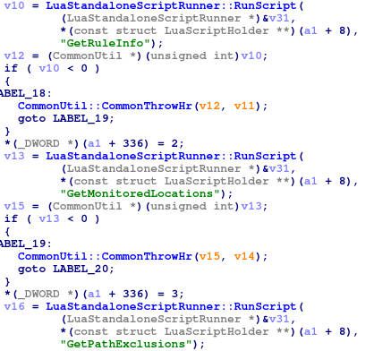

We can track the structure instantiated in this function to see it used in `HipsManager::IsASRExcludedTarget` > `HipsManager::IsRuleExcludedTarget`, for instance.

### Rule example 2: Block Adobe Reader from creating child processes

Here is a rule with more monitored locations, and exceptions:

```lua
GetRuleInfo = function()
  -- function num : 0_0
  local l_1_0 = {}
  l_1_0.Name = "Block Adobe Reader from creating child processes"
  l_1_0.Description = "Windows Defender Exploit Guard detected Adobe Reader launching child process"
  return l_1_0
end

GetMonitoredLocations = function()
  -- function num : 0_1
  local l_2_0 = {}
  l_2_0["%programfiles%\\adobe\\acrobat reader 2015\\reader\\acrord32.exe"] = 2
  l_2_0["%programfiles%\\adobe\\acrobat reader 2017\\reader\\acrord32.exe"] = 2
  l_2_0["%programfiles%\\adobe\\acrobat reader 2018\\reader\\acrord32.exe"] = 2
  l_2_0["%programfiles%\\adobe\\acrobat reader dc\\reader\\acrord32.exe"] = 2
  l_2_0["%programfiles%\\adobe\\reader 10.0\\reader\\acrord32.exe"] = 2
  l_2_0["%programfiles%\\adobe\\reader 11.0\\reader\\acrord32.exe"] = 2
  l_2_0["%programfiles%\\adobe\\reader 8.0\\reader\\acrord32.exe"] = 2
  l_2_0["%programfiles%\\adobe\\reader 9.0\\reader\\acrord32.exe"] = 2
  l_2_0["%programfiles%\\adobe\\reader\\11.0\\reader\\acrord32.exe"] = 2
  l_2_0["%programfiles%\\adobe\\reader\\acrord32.exe"] = 2
  l_2_0["%programfiles%\\adobe\\reader\\reader\\acrord32.exe"] = 2
  l_2_0["%programfiles(x86)%\\adobe\\acrobat reader 2015\\reader\\acrord32.exe"] = 2
  l_2_0["%programfiles(x86)%\\adobe\\acrobat reader 2017\\reader\\acrord32.exe"] = 2
  l_2_0["%programfiles(x86)%\\adobe\\acrobat reader 2018\\reader\\acrord32.exe"] = 2
  l_2_0["%programfiles(x86)%\\adobe\\acrobat reader dc\\reader\\acrord32.exe"] = 2
  l_2_0["%programfiles(x86)%\\adobe\\reader 10.0\\reader\\acrord32.exe"] = 2
  l_2_0["%programfiles(x86)%\\adobe\\reader 11.0\\reader\\acrord32.exe"] = 2
  l_2_0["%programfiles(x86)%\\adobe\\reader 8.0\\reader\\acrord32.exe"] = 2
  l_2_0["%programfiles(x86)%\\adobe\\reader 9.0\\reader\\acrord32.exe"] = 2
  l_2_0["%programfiles(x86)%\\adobe\\reader\\11.0\\reader\\acrord32.exe"] = 2
  l_2_0["%programfiles(x86)%\\adobe\\reader\\acrord32.exe"] = 2
  l_2_0["%programfiles(x86)%\\adobe\\reader\\reader\\acrord32.exe"] = 2
  l_2_0["%programfiles%\\adobe\\acrobat 10.0\\acrobat\\acrobat.exe"] = 2
  l_2_0["%programfiles%\\adobe\\acrobat 11.0\\acrobat\\acrobat.exe"] = 2
  l_2_0["%programfiles%\\adobe\\acrobat 2015\\acrobat\\acrobat.exe"] = 2
  l_2_0["%programfiles%\\adobe\\acrobat 2017\\acrobat\\acrobat.exe"] = 2
  l_2_0["%programfiles%\\adobe\\acrobat 5.0\\acrobat\\acrobat.exe"] = 2
  l_2_0["%programfiles%\\adobe\\acrobat 6.0\\acrobat\\acrobat.exe"] = 2
  l_2_0["%programfiles%\\adobe\\acrobat 7.0\\acrobat\\acrobat.exe"] = 2
  l_2_0["%programfiles%\\adobe\\acrobat 8.0\\acrobat\\acrobat.exe"] = 2
  l_2_0["%programfiles%\\adobe\\acrobat 9.0\\acrobat\\acrobat.exe"] = 2
  l_2_0["%programfiles%\\adobe\\acrobat dc\\acrobat\\acrobat.exe"] = 2
  l_2_0["%programfiles(x86)%\\adobe\\acrobat 10.0\\acrobat\\acrobat.exe"] = 2
  l_2_0["%programfiles(x86)%\\adobe\\acrobat 11.0\\acrobat\\acrobat.exe"] = 2
  l_2_0["%programfiles(x86)%\\adobe\\acrobat 2015\\acrobat\\acrobat.exe"] = 2
  l_2_0["%programfiles(x86)%\\adobe\\acrobat 2017\\acrobat\\acrobat.exe"] = 2
  l_2_0["%programfiles(x86)%\\adobe\\acrobat 5.0\\acrobat\\acrobat.exe"] = 2
  l_2_0["%programfiles(x86)%\\adobe\\acrobat 6.0\\acrobat\\acrobat.exe"] = 2
  l_2_0["%programfiles(x86)%\\adobe\\acrobat 7.0\\acrobat\\acrobat.exe"] = 2
  l_2_0["%programfiles(x86)%\\adobe\\acrobat 8.0\\acrobat\\acrobat.exe"] = 2
  l_2_0["%programfiles(x86)%\\adobe\\acrobat 9.0\\acrobat\\acrobat.exe"] = 2
  l_2_0["%programfiles(x86)%\\adobe\\acrobat dc\\acrobat\\acrobat.exe"] = 2
  return 1, l_2_0
end

GetPathExclusions = function()
  -- function num : 0_2
  local l_3_0 = {}
  l_3_0["%commonprogramfiles%\\adobe"] = 2
  l_3_0["%commonprogramfiles%\\microsoft shared"] = 2
  l_3_0["%commonprogramfiles(x86)%\\adobe"] = 2
  l_3_0["%commonprogramfiles(x86)%\\microsoft shared"] = 2
  l_3_0["%programdata%\\app-v"] = 2
  l_3_0["%programfiles%\\acrobat"] = 2
  l_3_0["%programfiles%\\adobe"] = 2
  l_3_0["%programfiles%\\firefox developer edition"] = 2
  l_3_0["%programfiles%\\foxit software"] = 2
  l_3_0["%programfiles%\\google"] = 2
  l_3_0["%programfiles%\\internet explorer"] = 2
  l_3_0["%programfiles%\\microsoft application virtualization\\client\\subsystems\\appvdllsurrogate32.exe"] = 2
  l_3_0["%programfiles%\\microsoft application virtualization\\client\\subsystems\\appvdllsurrogate64.exe"] = 2
  l_3_0["%programfiles%\\microsoft office 15"] = 2
  l_3_0["%programfiles%\\microsoft office 2003"] = 2
  l_3_0["%programfiles%\\microsoft office 2010"] = 2
  l_3_0["%programfiles%\\microsoft office 2016"] = 2
  l_3_0["%programfiles%\\microsoft office"] = 2
  l_3_0["%programfiles%\\microsoft office2003"] = 2
  l_3_0["%programfiles%\\microsoft office2007"] = 2
  l_3_0["%programfiles%\\microsoft office\\2010"] = 2
  l_3_0["%programfiles%\\microsoft office\\live meeting 8"] = 2
  l_3_0["%programfiles%\\microsoft office\\office"] = 2
  l_3_0["%programfiles%\\microsoft office\\office10"] = 2
  l_3_0["%programfiles%\\microsoft office\\office11"] = 2
  l_3_0["%programfiles%\\microsoft office\\office12"] = 2
  l_3_0["%programfiles%\\microsoft office\\office13"] = 2
  l_3_0["%programfiles%\\microsoft office\\office14"] = 2
  l_3_0["%programfiles%\\microsoft office\\office15"] = 2
  l_3_0["%programfiles%\\microsoft office\\office16"] = 2
  l_3_0["%programfiles%\\microsoft office\\root\\2010"] = 2
  l_3_0["%programfiles%\\microsoft office\\root\\client\\appvdllsurrogate32.exe"] = 2
  l_3_0["%programfiles%\\microsoft office\\root\\client\\appvdllsurrogate64.exe"] = 2
  l_3_0["%programfiles%\\microsoft office\\root\\live meeting 8"] = 2
  l_3_0["%programfiles%\\microsoft office\\root\\office"] = 2
  l_3_0["%programfiles%\\microsoft office\\root\\office10"] = 2
  l_3_0["%programfiles%\\microsoft office\\root\\office11"] = 2
  l_3_0["%programfiles%\\microsoft office\\root\\office12"] = 2
  l_3_0["%programfiles%\\microsoft office\\root\\office13"] = 2
  l_3_0["%programfiles%\\microsoft office\\root\\office14"] = 2
  l_3_0["%programfiles%\\microsoft office\\root\\office15"] = 2
  l_3_0["%programfiles%\\microsoft office\\root\\office16"] = 2
  l_3_0["%programfiles%\\microsoft office\\root\\updates"] = 2
  l_3_0["%programfiles%\\microsoft office\\root\\vfs"] = 2
  l_3_0["%programfiles%\\microsoft office\\root\\visio"] = 2
  l_3_0["%programfiles%\\microsoft office\\root\\visio10"] = 2
  l_3_0["%programfiles%\\microsoft office\\root\\visio11"] = 2
  l_3_0["%programfiles%\\microsoft office\\root\\visio12"] = 2
  l_3_0["%programfiles%\\microsoft office\\root\\visio13"] = 2
  l_3_0["%programfiles%\\microsoft office\\updates"] = 2
  l_3_0["%programfiles%\\microsoft office\\vfs"] = 2
  l_3_0["%programfiles%\\microsoft office\\visio"] = 2
  l_3_0["%programfiles%\\microsoft office\\visio10"] = 2
  l_3_0["%programfiles%\\microsoft office\\visio11"] = 2
  l_3_0["%programfiles%\\microsoft office\\visio12"] = 2
  l_3_0["%programfiles%\\microsoft office\\visio13"] = 2
  l_3_0["%programfiles%\\microsoft security client"] = 2
  l_3_0["%programfiles%\\mozilla firefox"] = 2
  l_3_0["%programfiles%\\opera"] = 2
  l_3_0["%programfiles%\\reader"] = 2
  l_3_0["%programfiles%\\sogouinput"] = 2
  l_3_0["%programfiles%\\tencent"] = 2
  l_3_0["%programfiles%\\ucbrowser"] = 2
  l_3_0["%programfiles%\\winrar"] = 2
  l_3_0["%programfiles%\\winzip"] = 2
  l_3_0["%programfiles%\\Microsoft\\Edge\\Application"] = 2
  l_3_0["%programfiles%\\Microsoft\\Edge\\Application\\msedge.exe"] = 2
  l_3_0["%programfiles%\\Microsoft\\Edge Dev\\Application\\msedge.exe"] = 2
  l_3_0["%programfiles%\\Microsoft\\Edge Beta\\Application\\msedge.exe"] = 2
  l_3_0["%programfiles%\\Microsoft\\Edge\\Application\\*\\msedgewebview2.exe"] = 2
  l_3_0["%programfiles%\\Microsoft\\Edge Dev\\Application\\*\\msedgewebview2.exe"] = 2
  l_3_0["%programfiles%\\Microsoft\\Edge Beta\\Application\\*\\msedgewebview2.exe"] = 2
  l_3_0["%programfiles%\\Microsoft\\EdgeWebView\\Application\\*\\msedgewebview2.exe"] = 2
  l_3_0["%programfiles(x86)%\\acrobat"] = 2
  l_3_0["%programfiles(x86)%\\acrobat dc"] = 2
  l_3_0["%programfiles(x86)%\\adobe"] = 2
  l_3_0["%programfiles(x86)%\\firefox developer edition"] = 2
  l_3_0["%programfiles(x86)%\\foxit software"] = 2
  l_3_0["%programfiles(x86)%\\google"] = 2
  l_3_0["%programfiles(x86)%\\internet explorer"] = 2
  l_3_0["%programfiles(x86)%\\microsoft application virtualization\\client\\subsystems\\appvdllsurrogate32.exe"] = 2
  l_3_0["%programfiles(x86)%\\microsoft application virtualization\\client\\subsystems\\appvdllsurrogate64.exe"] = 2
  l_3_0["%programfiles(x86)%\\microsoft office 15"] = 2
  l_3_0["%programfiles(x86)%\\microsoft office 2003"] = 2
  l_3_0["%programfiles(x86)%\\microsoft office 2010"] = 2
  l_3_0["%programfiles(x86)%\\microsoft office 2016"] = 2
  l_3_0["%programfiles(x86)%\\microsoft office"] = 2
  l_3_0["%programfiles(x86)%\\microsoft office2003"] = 2
  l_3_0["%programfiles(x86)%\\microsoft office2007"] = 2
  l_3_0["%programfiles(x86)%\\microsoft office\\2010"] = 2
  l_3_0["%programfiles(x86)%\\microsoft office\\live meeting 8"] = 2
  l_3_0["%programfiles(x86)%\\microsoft office\\office"] = 2
  l_3_0["%programfiles(x86)%\\microsoft office\\office10"] = 2
  l_3_0["%programfiles(x86)%\\microsoft office\\office11"] = 2
  l_3_0["%programfiles(x86)%\\microsoft office\\office12"] = 2
  l_3_0["%programfiles(x86)%\\microsoft office\\office13"] = 2
  l_3_0["%programfiles(x86)%\\microsoft office\\office14"] = 2
  l_3_0["%programfiles(x86)%\\microsoft office\\office15"] = 2
  l_3_0["%programfiles(x86)%\\microsoft office\\office16"] = 2
  l_3_0["%programfiles(x86)%\\microsoft office\\root\\2010"] = 2
  l_3_0["%programfiles(x86)%\\microsoft office\\root\\client\\appvdllsurrogate32.exe"] = 2
  l_3_0["%programfiles(x86)%\\microsoft office\\root\\client\\appvdllsurrogate64.exe"] = 2
  l_3_0["%programfiles(x86)%\\microsoft office\\root\\live meeting 8"] = 2
  l_3_0["%programfiles(x86)%\\microsoft office\\root\\office"] = 2
  l_3_0["%programfiles(x86)%\\microsoft office\\root\\office10"] = 2
  l_3_0["%programfiles(x86)%\\microsoft office\\root\\office11"] = 2
  l_3_0["%programfiles(x86)%\\microsoft office\\root\\office12"] = 2
  l_3_0["%programfiles(x86)%\\microsoft office\\root\\office13"] = 2
  l_3_0["%programfiles(x86)%\\microsoft office\\root\\office14"] = 2
  l_3_0["%programfiles(x86)%\\microsoft office\\root\\office15"] = 2
  l_3_0["%programfiles(x86)%\\microsoft office\\root\\office16"] = 2
  l_3_0["%programfiles(x86)%\\microsoft office\\root\\updates"] = 2
  l_3_0["%programfiles(x86)%\\microsoft office\\root\\vfs"] = 2
  l_3_0["%programfiles(x86)%\\microsoft office\\root\\visio"] = 2
  l_3_0["%programfiles(x86)%\\microsoft office\\root\\visio10"] = 2
  l_3_0["%programfiles(x86)%\\microsoft office\\root\\visio11"] = 2
  l_3_0["%programfiles(x86)%\\microsoft office\\root\\visio12"] = 2
  l_3_0["%programfiles(x86)%\\microsoft office\\root\\visio13"] = 2
  l_3_0["%programfiles(x86)%\\microsoft office\\updates"] = 2
  l_3_0["%programfiles(x86)%\\microsoft office\\vfs"] = 2
  l_3_0["%programfiles(x86)%\\microsoft office\\visio"] = 2
  l_3_0["%programfiles(x86)%\\microsoft office\\visio10"] = 2
  l_3_0["%programfiles(x86)%\\microsoft office\\visio11"] = 2
  l_3_0["%programfiles(x86)%\\microsoft office\\visio12"] = 2
  l_3_0["%programfiles(x86)%\\microsoft office\\visio13"] = 2
  l_3_0["%programfiles(x86)%\\microsoft security client"] = 2
  l_3_0["%programfiles(x86)%\\mozilla firefox"] = 2
  l_3_0["%programfiles(x86)%\\opera"] = 2
  l_3_0["%programfiles(x86)%\\reader"] = 2
  l_3_0["%programfiles(x86)%\\sogouinput"] = 2
  l_3_0["%programfiles(x86)%\\tencent"] = 2
  l_3_0["%programfiles(x86)%\\ucbrowser"] = 2
  l_3_0["%programfiles(x86)%\\winrar"] = 2
  l_3_0["%programfiles(x86)%\\winzip"] = 2
  l_3_0["%programfiles(x86)%\\Microsoft\\Edge\\Application"] = 2
  l_3_0["%programfiles(x86)%\\Microsoft\\Edge\\Application\\msedge.exe"] = 2
  l_3_0["%programfiles(x86)%\\Microsoft\\Edge Dev\\Application\\msedge.exe"] = 2
  l_3_0["%programfiles(x86)%\\Microsoft\\Edge Beta\\Application\\msedge.exe"] = 2
  l_3_0["%programfiles(x86)%\\Microsoft\\Edge\\Application\\*\\msedgewebview2.exe"] = 2
  l_3_0["%programfiles(x86)%\\Microsoft\\Edge Dev\\Application\\*\\msedgewebview2.exe"] = 2
  l_3_0["%programfiles(x86)%\\Microsoft\\Edge Beta\\Application\\*\\msedgewebview2.exe"] = 2
  l_3_0["%programfiles(x86)%\\Microsoft\\EdgeWebView\\Application\\*\\msedgewebview2.exe"] = 2
  l_3_0["%programW6432%\\Microsoft\\Edge\\Application\\msedge.exe"] = 2
  l_3_0["%programW6432%\\Microsoft\\Edge Dev\\Application\\msedge.exe"] = 2
  l_3_0["%programW6432%\\Microsoft\\Edge Beta\\Application\\msedge.exe"] = 2
  l_3_0["%programW6432%\\Microsoft\\Edge\\Application\\*\\msedgewebview2.exe"] = 2
  l_3_0["%programW6432%\\Microsoft\\Edge Dev\\Application\\*\\msedgewebview2.exe"] = 2
  l_3_0["%programW6432%\\Microsoft\\Edge Beta\\Application\\*\\msedgewebview2.exe"] = 2
  l_3_0["%programW6432%\\Microsoft\\EdgeWebView\\Application\\*\\msedgewebview2.exe"] = 2
  l_3_0["%programfiles(x86)%\\BraveSoftware\\Brave-Browser\\Application\\brave.exe"] = 2
  l_3_0["%localappdata%\\microsoft\\edge\\application\\msedge.exe"] = 1
  l_3_0["%localappdata%\\microsoft\\edge sxs\\application\\msedge.exe"] = 1
  l_3_0["%localappdata%\\microsoft\\edge dev\\application\\msedge.exe"] = 1
  l_3_0["%localappdata%\\microsoft\\edge beta\\application\\msedge.exe"] = 1
  l_3_0["%localappdata%\\microsoft\\edgewebview\\application\\*\\msedgewebview2.exe"] = 1
  l_3_0["%localappdata%\\microsoft\\edge sxs\\application\\*\\msedgewebview2.exe"] = 1
  l_3_0["%localappdata%\\microsoft\\edge dev\\application\\*\\msedgewebview2.exe"] = 1
  l_3_0["%localappdata%\\microsoft\\edge beta\\application\\*\\msedgewebview2.exe"] = 1
  l_3_0["%localappdata%\\mozilla firefox\\*\\firefoxportable\\app\\firefox64\\firefox.exe"] = 1
  l_3_0["%localappdata%\\mozilla firefox\\firefox.exe"] = 1
  l_3_0["%localappdata%\\centbrowser\\application\\chrome.exe"] = 1
  l_3_0["%localappdata%\\chromium\\application\\chrome.exe"] = 1
  l_3_0["%localappdata%\\epic privacy browser\\application\\epic.exe"] = 1
  l_3_0["%localappdata%\\firefox developer edition\\firefox.exe"] = 1
  l_3_0["%localappdata%\\google chrome\\*\\googlechromeportable\\app\\chrome-bin\\chrome.exe"] = 1
  l_3_0["%localappdata%\\google\\chrome beta\\application\\chrome.exe"] = 1
  l_3_0["%localappdata%\\google\\chrome dev\\application\\chrome.exe"] = 1
  l_3_0["%localappdata%\\google\\chrome sxs\\application\\chrome.exe"] = 1
  l_3_0["%localappdata%\\google\\chrome\\application\\chrome.exe"] = 1
  l_3_0["%windir%\\explorer.exe"] = 2
  l_3_0["%windir%\\microsoft.net\\framework\\*\\dw20.exe"] = 2
  l_3_0["%windir%\\notepad.exe"] = 2
  l_3_0["%windir%\\splwow64.exe"] = 2
  l_3_0["%windir%\\ssdal.exe"] = 2
  l_3_0["%windir%\\system32\\atbroker.exe"] = 2
  l_3_0["%windir%\\system32\\bdeunlock.exe"] = 2
  l_3_0["%windir%\\system32\\buaappnt.exe"] = 2
  l_3_0["%windir%\\system32\\conhost.exe"] = 2
  l_3_0["%windir%\\system32\\ctfmon.exe"] = 2
  l_3_0["%windir%\\system32\\dwwin.exe"] = 2
  l_3_0["%windir%\\system32\\ie4uinit.exe"] = 2
  l_3_0["%windir%\\system32\\igfxem.exe"] = 2
  l_3_0["%windir%\\system32\\igfxhk.exe"] = 2
  l_3_0["%windir%\\system32\\igfxtray.exe"] = 2
  l_3_0["%windir%\\system32\\macromed\\flash\\flashplayerupdateservice.exe"] = 2
  l_3_0["%windir%\\system32\\microsoft.uev.synccontroller.exe"] = 2
  l_3_0["%windir%\\system32\\notepad.exe"] = 2
  l_3_0["%windir%\\system32\\ntprint.exe"] = 2
  l_3_0["%windir%\\system32\\pcaui.exe"] = 2
  l_3_0["%windir%\\system32\\searchprotocolhost.exe"] = 2
  l_3_0["%windir%\\system32\\slui.exe"] = 2
  l_3_0["%windir%\\system32\\spool\\drivers"] = 2
  l_3_0["%windir%\\system32\\verclsid.exe"] = 2
  l_3_0["%windir%\\system32\\werfault.exe"] = 2
  l_3_0["%windir%\\system32\\werfaultsecure.exe"] = 2
  l_3_0["%windir%\\system32\\wermgr.exe"] = 2
  l_3_0["%windir%\\system32\\wevtutil.exe"] = 2
  l_3_0["%windir%\\system32\\wfs.exe"] = 2
  l_3_0["%windir%\\system32\\xpsrchvw.exe"] = 2
  l_3_0["%windir%\\system32\\msiexec.exe"] = 2
  l_3_0["%windir%\\syswow64\\config\\systemprofile\\sogouinput\\*\\sgtool.exe"] = 2
  l_3_0["%windir%\\syswow64\\ctfmon.exe"] = 2
  l_3_0["%windir%\\syswow64\\dwwin.exe"] = 2
  l_3_0["%windir%\\syswow64\\ieunatt.exe"] = 2
  l_3_0["%windir%\\syswow64\\ime\\imejp\\imjpdct.exe"] = 2
  l_3_0["%windir%\\syswow64\\ime\\shared\\imecfmui.exe"] = 2
  l_3_0["%windir%\\syswow64\\ime\\shared\\imepadsv.exe"] = 2
  l_3_0["%windir%\\syswow64\\macromed\\flash\\flashplayerupdateservice.exe"] = 2
  l_3_0["%windir%\\syswow64\\mspaint.exe"] = 2
  l_3_0["%windir%\\syswow64\\notepad.exe"] = 2
  l_3_0["%windir%\\syswow64\\openwith.exe"] = 2
  l_3_0["%windir%\\syswow64\\prevhost.exe"] = 2
  l_3_0["%windir%\\syswow64\\verclsid.exe"] = 2
  l_3_0["%windir%\\syswow64\\werfault.exe"] = 2
  l_3_0["%windir%\\syswow64\\wermgr.exe"] = 2
  l_3_0["%windir%\\syswow64\\xpsrchvw.exe"] = 2
  l_3_0["%windir%\\syswow64\\msiexec.exe"] = 2
  l_3_0["%windir%\\systemapps\\*\\microsoftedgecp.exe"] = 2
  l_3_0["%windir%\\winsxs\\*\\iexplore.exe"] = 2
  l_3_0["%windir%\\winsxs\\*\\splwow64.exe"] = 2
  l_3_0["%windir%\\winsxs\\*\\werfault.exe"] = 2
  l_3_0["%userprofile%\\appdata\\local\\google\\chrome"] = 1
  l_3_0["%userprofile%\\appdata\\local\\microsoft\\onedrive"] = 1
  l_3_0["%userprofile%\\appdata\\locallow\\copitrak"] = 1
  l_3_0["%userprofile%\\appdata\\local\\centbrowser\\application\\chrome.exe"] = 1
  l_3_0["%userprofile%\\appdata\\local\\microsoft\\edge\\application\\msedge.exe"] = 1
  l_3_0["%userprofile%\\appdata\\local\\microsoft\\edge sxs\\application\\msedge.exe"] = 1
  l_3_0["%userprofile%\\appdata\\local\\microsoft\\edge dev\\application\\msedge.exe"] = 1
  l_3_0["%userprofile%\\appdata\\local\\microsoft\\edge beta\\application\\msedge.exe"] = 1
  l_3_0["%userprofile%\\appdata\\local\\microsoft\\edgewebview\\application\\*\\msedgewebview2.exe"] = 1
  l_3_0["%userprofile%\\appdata\\local\\microsoft\\edge sxs\\application\\*\\msedgewebview2.exe"] = 1
  l_3_0["%userprofile%\\appdata\\local\\microsoft\\edge dev\\application\\*\\msedgewebview2.exe"] = 1
  l_3_0["%userprofile%\\appdata\\local\\microsoft\\edge beta\\application\\*\\msedgewebview2.exe"] = 1
  l_3_0["%userprofile%\\appdata\\local\\mozilla firefox\\*\\firefoxportable\\app\\firefox64\\firefox.exe"] = 1
  l_3_0["%userprofile%\\appdata\\local\\mozilla firefox\\firefox.exe"] = 1
  l_3_0["%userprofile%\\appdata\\local\\packages\\*\\localcache\\local\\google\\chrome\\application\\chrome.exe"] = 1
  l_3_0["%userprofile%\\appdata\\local\\packages\\*\\localcache\\local\\mozilla firefox\\firefox.exe"] = 1
  return l_3_0
end

```

### Rule example 3: Controlled folder access

Using the same construction pattern:
```lua
GetRuleInfo = function()
  -- function num : 0_0
  local l_1_0 = {}
  l_1_0.Name = "Controlled folder access"
  l_1_0.Description = "Windows Defender Exploit Guard detected the unauthorized modification of files in protected folder"
  return l_1_0
end

GetPathExclusions = function()
  -- function num : 0_1
  local l_2_0 = {}
  l_2_0["%windir%\\SysWOW64\\WerFault.exe"] = 2
  l_2_0["%windir%\\system32\\WerFault.exe"] = 2
  l_2_0.Registry = 2
  l_2_0.MemCompression = 2
  l_2_0["%windir%\\system32\\bcdedit.exe"] = 2
  l_2_0["%windir%\\system32\\MBR2GPT.EXE"] = 2
  l_2_0["%windir%\\system32\\CompatTelRunner.exe"] = 2
  l_2_0["%windir%\\system32\\ReAgentc.exe"] = 2
  l_2_0["%localappdata%\\microsoft\\Teams\\Update.exe "] = 1
  l_2_0["%systemdrive%\\$WINDOWS.~BT\\Sources\\SetupHost.exe"] = 2
  l_2_0["%systemdrive%\\$WINDOWS.~BT\\Work\\*\\DismHost.exe"] = 2
  return l_2_0
end
```

Actually, this rule does not belong to the ASR rules, but rather to [Controlled folder access](https://docs.microsoft.com/en-us/microsoft-365/security/defender-endpoint/controlled-folders?view=o365-worldwide) (still in the "Attack surface reduction" documentation, but at the same level as "Exploit protection" or "Web protection").

According to the header just before the precompiled script, its GUID is `5737d832-9e2c-4922-9623-48a220290dcb`.

### Hidden rules

There are even some undocumented rules:

```lua
GetRuleInfo = function()
  -- function num : 0_0
  local l_1_0 = {}
  l_1_0.Name = "Aplha Test for ASR in Audit Mode"
  l_1_0.Description = "Generic ASR Audit mode use for unit testing"
  return l_1_0
end

GetMonitoredLocations = function()
  -- function num : 0_1
  local l_2_0 = {}
  l_2_0["%windir%\\system32\\wbem\\WmiPrvSE.exe"] = 2
  l_2_0["%windir%\\PSEXESVC.exe"] = 2
  return 1, l_2_0
end

GetPathExclusions = function()
  -- function num : 0_2
  local l_3_0 = {}
  l_3_0["%windir%\\system32\\wbem\\WmiPrvSE.exe"] = 2
  l_3_0["%windir%\\system32\\wbem\\mofcomp.exe"] = 2
  l_3_0["%windir%\\system32\\svchost.exe"] = 2
  l_3_0["%windir%\\system32\\WerFault.exe"] = 2
  l_3_0["%windir%\\system32\\wuauclt.exe"] = 2
  l_3_0["%windir%\\system32\\gpupdate.exe"] = 2
  l_3_0["%windir%\\SysWOW64\\wbem\\WmiPrvSE.exe"] = 2
  l_3_0["%windir%\\SysWOW64\\wbem\\mofcomp.exe"] = 2
  l_3_0["%windir%\\SysWOW64\\svchost.exe"] = 2
  l_3_0["%windir%\\SysWOW64\\WerFault.exe"] = 2
  l_3_0["%windir%\\SysWOW64\\wuauclt.exe"] = 2
  l_3_0["%windir%\\SysWOW64\\gpupdate.exe"] = 2
  l_3_0["%windir%\\system32\\spool\\drivers"] = 2
  l_3_0["%windir%\\PSEXESVC.exe"] = 2
  l_3_0["%windir%\\Temp\\*\\DismHost.exe"] = 2
  l_3_0["%systemdrive%\\*\\Tools\\MDATPClientAnalyzer.exe"] = 2
  l_3_0["%systemdrive%\\*\\WDATPDeploy\\MDATPClientAnalyzer\\MDATPClientAnalyzer.exe"] = 2
  l_3_0["%windir%\\CCM\\Ccm32BitLauncher.exe"] = 2
  return l_3_0
end

GetCommandLineExclusions = function()
  -- function num : 0_3
  local l_4_0 = ".:\\\\windows\\\\ccmcache\\\\.+"
  local l_4_1 = ".:\\\\windows\\\\ccm\\\\systemtemp\\\\.+"
  local l_4_2 = {}
  l_4_2[l_4_0] = 2
  l_4_2[l_4_1] = 2
  return l_4_2
end
```

Its GUID, according to the header before the Lua compiled script, is `a1ef78eb-fe9b-4fb2-b548-50b85b4d2af7`.

Another rule, *Block abuse of in-the-wild exploited vulnerable signed drivers* (GUID `56a863a9-875e-4185-98a7-b882c64b5ce5`) can be found this way. This rule seems more production-oriented, but at the time of writing, there is no hit on Google (still, it seems related to [this tweet](https://twitter.com/dwizzzlemsft/status/1267507875619848198?lang=en)).

Here is a list of other undocumented rules:

* *MSFT org test rule* (`1d9fb1e9-5186-49a5-92bd-86a3db551b47`)
> This is a Test HIPS Rule that exposes rule logic in audit mode to \'X\' population within MSFT org
* *Double Extension rule for consumer* (`fd960b4a-d8d7-4590-a6ce-0219df56a135`)
> Block malicious double extension
* *Aplha Test for ASR in Block Mode* (`c28bf0fb-388c-438b-a41d-8688461af900`)
> Generic ASR Block mode use for unit testing
* *WIAD org test rule* (`caf67f1f-2ab8-4d6b-9146-52ebe33baeba`)
> This is a Test HIPS Rule that exposes rule logic in audit mode to entire WIAD org


## Profit

As we now have access to the actual checks made, we can search for bypasses.

For instance, let's have a look at the GUID `3B576869-A4EC-4529-8536-B80A7769E899`, *Block Office applications from creating executable content*.

Here is one of the relevant rule:

```lua
if not (mp.IsHipsRuleEnabled)("3b576869-a4ec-4529-8536-b80a7769e899") then
  return mp.CLEAN
end
if GetCtxOfficeProc() ~= "productivity" then
  return mp.CLEAN
end
```

First, the code checks if the rule is indeed enabled, and if the process making the content creation is marked `productivity` by `GetCtxOfficeProc` (its code is above).
Let's imagine we are using Excel, so the check is valid.

```lua
local l_0_0 = {}
l_0_0[".bat"] = true
l_0_0[".cmd"] = true
l_0_0[".hta"] = true
l_0_0[".jar"] = true
l_0_0[".js"] = true
l_0_0[".jse"] = true
l_0_0[".lnk"] = true
l_0_0[".pif"] = true
l_0_0[".ps1"] = true
l_0_0[".psc1"] = true
l_0_0[".settingcontent-ms"] = true
l_0_0[".appcontent-ms"] = true
l_0_0[".application"] = true
l_0_0[".scr"] = true
l_0_0[".sys"] = true
l_0_0[".vbe"] = true
l_0_0[".vbs"] = true
l_0_0[".wsc"] = true
l_0_0[".wsf"] = true
l_0_0[".wsh"] = true
l_0_0[".ocx"] = true
l_0_0[".com"] = true
l_0_0[".exe"] = true
l_0_0[".dll"] = true
local l_0_1 = (mp.get_contextdata)(mp.CONTEXT_DATA_FILENAME)
```

A list of extensions is then prepared. This is the list of extensions considered as "executable content", which will be refused.

### Expected behavior

We can test that rule using the demo [ASR test tool](https://demo.wd.microsoft.com/Page/ASR2).

First, we enable the rule:

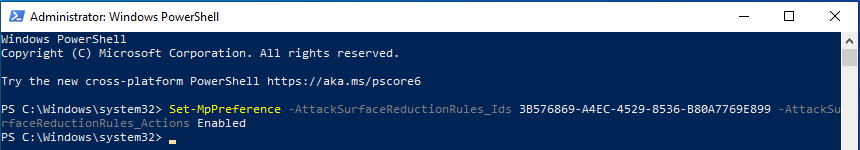

Then we run the test scenario:

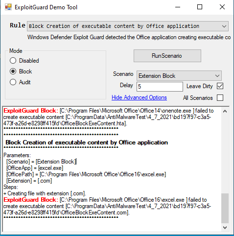

The tool is actually creating a fake file (here `C:\Program Files\Microsoft Office\Office16\excel.exe`) which will in turn create a file with a forbidden extension. As the test made by ASR is based on ImagePath, it is indeed blocked.

We can ensure the option is actually working for real using VBA in Excel.
We write a dummy *download-and-exec* script, and launch it in Excel:

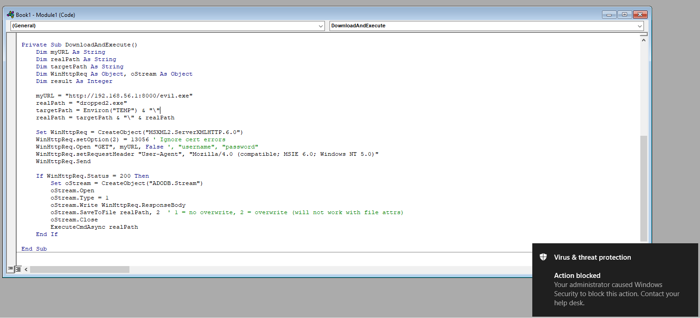

It is indeed detected by ASR, and we also have the corresponding event:

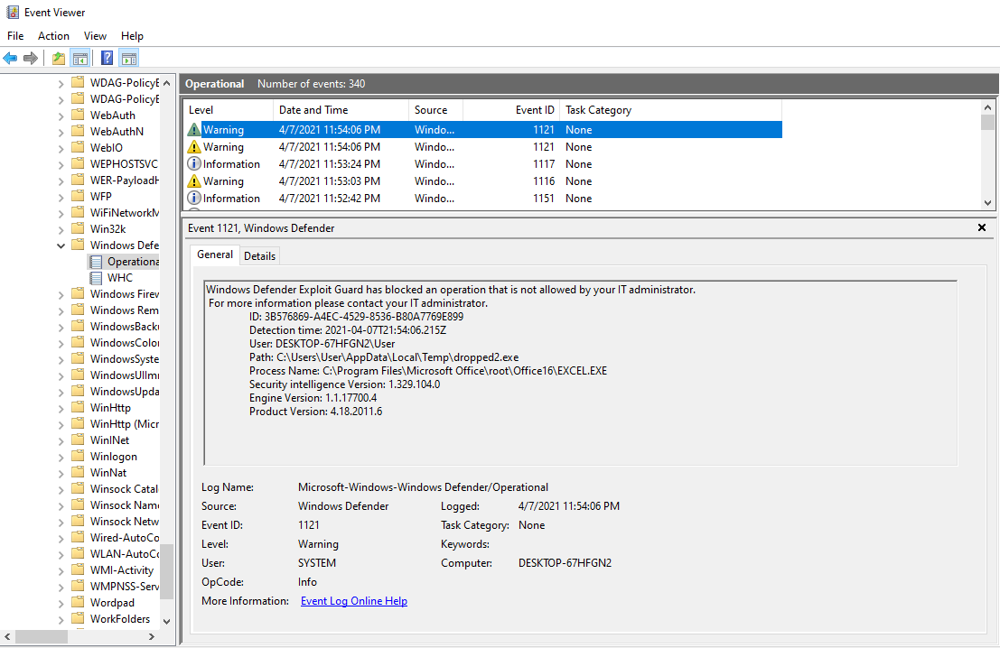

### Bypassing it

If we continue to read the aforementioned Lua script, we can observe a series of whitelisted elements, depending on the extension:
```lua
l_0_1 = (l_0_1 == nil and "" or l_0_1):lower()
if (l_0_1:sub(-20)):match("(%.[%w%-]+)$") ~= nil or not "" then
  local l_0_3 = nil
  local l_0_4 = ((mp.PathToWin32Path)((mp.get_contextdata)(mp.CONTEXT_DATA_FILEPATH)) == nil and "" or (mp.PathToWin32Path)((mp.get_contextdata)(mp.CONTEXT_DATA_FILEPATH))):lower()
  local l_0_5 = ((mp.ContextualExpandEnvironmentVariables)("%appdata%") == nil and "" or (mp.ContextualExpandEnvironmentVariables)("%appdata%")):lower()
  local l_0_6 = ((mp.ContextualExpandEnvironmentVariables)("%localappdata%") == nil and "" or (mp.ContextualExpandEnvironmentVariables)("%localappdata%")):lower()
  local l_0_7 = ((mp.ContextualExpandEnvironmentVariables)("%temp%") == nil and "" or (mp.ContextualExpandEnvironmentVariables)("%temp%")):lower()
  local l_0_8 = ((mp.ContextualExpandEnvironmentVariables)("%programdata%") == nil and "" or (mp.ContextualExpandEnvironmentVariables)("%programdata%")):lower()
  local l_0_9 = ((mp.ContextualExpandEnvironmentVariables)("%systemdrive%") == nil and "" or (mp.ContextualExpandEnvironmentVariables)("%systemdrive%")):lower()
  local l_0_10 = ((mp.ContextualExpandEnvironmentVariables)("%systemroot%") == nil and "" or (mp.ContextualExpandEnvironmentVariables)("%systemroot%")):lower()
  if l_0_0[l_0_3] == true then
    if l_0_3 == ".lnk" then
      if l_0_4:find(l_0_5 .. "\\microsoft\\office\\", 1, true) ~= nil then
        return mp.CLEAN
      end
      if l_0_4:find(l_0_5 .. "\\microsoft\\excel\\", 1, true) ~= nil then
        return mp.CLEAN
      end
      if l_0_4:find(l_0_5 .. "\\microsoft\\onenote\\", 1, true) ~= nil then
        return mp.CLEAN
      end
      if l_0_4:find(l_0_5 .. "\\microsoft\\outlook\\", 1, true) ~= nil then
        return mp.CLEAN
      end
      if l_0_4:find(l_0_5 .. "\\microsoft\\powerpoint\\", 1, true) ~= nil then
        return mp.CLEAN
      end
      if l_0_4:find(l_0_5 .. "\\microsoft\\word\\", 1, true) ~= nil then
        return mp.CLEAN
      end
      if l_0_4:find(l_0_5 .. "\\microsoft\\internet explorer\\quick launch", 1, true) ~= nil then
        return mp.CLEAN
      end
      if l_0_4:find(l_0_5 .. "\\roaming\\microsoft\\", 1, true) ~= nil then
        return mp.CLEAN
      end
      if l_0_4 == l_0_5 .. "\\microsoft\\windows\\start menu\\programs\\startup" then
        return mp.CLEAN
      end
      if l_0_4 == l_0_6 .. "\\packages\\microsoft.office.desktop_8wekyb3d8bbwe\\localcache\\roaming\\microsoft\\internet explorer\\quick launch" then
        return mp.CLEAN
      end
      if l_0_4 == l_0_6 .. "\\packages\\microsoft.office.desktop_8wekyb3d8bbwe\\localcache\\roaming\\microsoft\\office\\recent" then
        return mp.CLEAN
      end
      if l_0_4 == l_0_6 .. "\\packages\\microsoft.office.desktop_8wekyb3d8bbwe\\localcache\\roaming\\microsoft\\windows\\start menu\\programs\\startup" then
        return mp.CLEAN
      end
      if l_0_4:find(l_0_6 .. "\\invincea\\enterprise\\", 1, true) ~= nil then
        return mp.CLEAN
      end
      if l_0_4:find(l_0_9 .. "\\appsensevirtual\\", 1, true) ~= nil then
        return mp.CLEAN
      end
      if l_0_4:find(l_0_10 .. "\\syswow64\\config\\systemprofile\\appdata\\roaming\\microsoft\\office\\", 1, true) ~= nil then
        return mp.CLEAN
      end
      if l_0_4 == ((mp.ContextualExpandEnvironmentVariables)("%userprofile%") == nil and "" or (mp.ContextualExpandEnvironmentVariables)("%userprofile%")):lower() .. "\\documents\\my data sources" then
        return mp.CLEAN
      end
      -- DECOMPILER ERROR at PC367: Confused about usage of register: R10 in 'UnsetPending'

      if l_0_4 == ((mp.ContextualExpandEnvironmentVariables)("%userprofile%") == nil and "" or (mp.ContextualExpandEnvironmentVariables)("%userprofile%")):lower() .. "\\onedrive\\documents\\my data sources" then
        return mp.CLEAN
      end
    else
      if l_0_3 == ".js" then
        if l_0_4:find(l_0_6 .. "\\microsoft\\windows\\inetcache\\ie\\", 1, true) ~= nil then
          return mp.CLEAN
        end
        if l_0_4:find(l_0_6 .. "\\microsoft\\windows\\temporary internet files\\content.ie5\\", 1, true) ~= nil then
          return mp.CLEAN
        end
        if l_0_4:find(l_0_6 .. "\\packages\\microsoft.office.desktop_8wekyb3d8bbwe\\ac\\inetcache\\", 1, true) ~= nil then
          return mp.CLEAN
        end
      else
        if l_0_3 == ".application" then
          if l_0_4:find(l_0_7 .. "\\deployment\\%w%w%w%w%w%w%w%w%.%w%w%w") ~= nil and l_0_1:find("^%w%w%w%w%w%w%w%w%.%w%w%w%.application$") ~= nil then
            return mp.CLEAN
          end
          local l_0_11 = nil
          if l_0_4:match("\\deployment\\%w%w%w%w%w%w%w%w%.%w%w%w$") ~= nil then
            if l_0_4:find(l_0_7 .. l_0_4:match("\\deployment\\%w%w%w%w%w%w%w%w%.%w%w%w$"), 1, true) and l_0_1:find("^%w%w%w%w%w%w%w%w%.%w%w%w%.application$") ~= nil then
              return mp.CLEAN
            end
            if l_0_1:find("^%w%w%w%w%w%w%w%w%.%w%w%w%.application$") ~= nil and l_0_4 == l_0_11 .. "\\appdata\\local\\temp" .. l_0_4:match("\\deployment\\%w%w%w%w%w%w%w%w%.%w%w%w$") then
              return mp.CLEAN
            end
          end
        else
          do
            if l_0_3 == ".dll" then
              if l_0_4:find(l_0_6 .. "\\assembly\\tmp\\", 1, true) ~= nil then
                return mp.CLEAN
              end
              if l_0_4:find("\\think-cell\\", 1, true) ~= nil then
                return mp.CLEAN
              end
            else
              if l_0_3 == ".exe" and l_0_4:find("\\think-cell\\", 1, true) ~= nil then
                return mp.CLEAN
              end
            end
            do return mp.INFECTED end
            if l_0_4:find(l_0_8 .. "\\microsoft\\windows\\start menu\\programs\\startup", 1, true) ~= nil then
              return mp.INFECTED
            end
            if l_0_4:find(l_0_5 .. "\\microsoft\\windows\\start menu\\programs\\startup", 1, true) ~= nil then
              return mp.INFECTED
            end
            return mp.CLEAN
          end
        end
      end
    end
  end
end
```

Some of them are hardly exploitable, as they check the whole path.
But others seem really interesting, such as:
```lua
if l_0_3 == ".exe" and l_0_4:find("\\think-cell\\", 1, true) ~= nil then
    return mp.CLEAN
end
```

If the target extension is `.exe` but there is a directory named `think-cell` somewhere in the path, then it is OK.

Let's check it out!

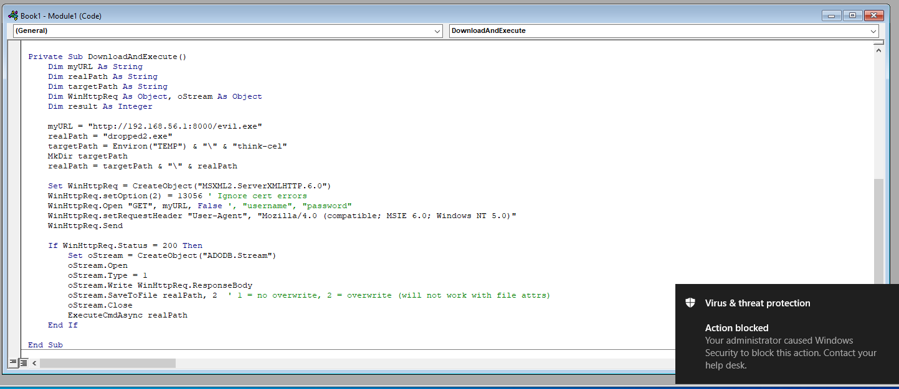

We first try with a directory close to the one whitelisted, but still different. The attempt is indeed stopped (as expected).

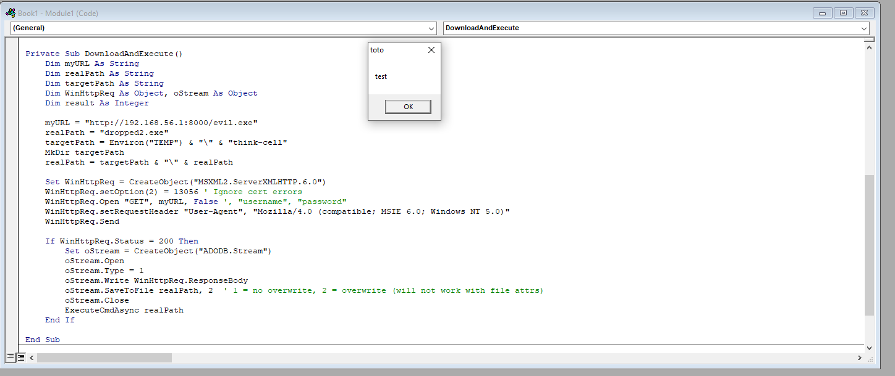

Now, we use the whitelisted directory and, voilà!

**Creating and executing our binary is now authorized**.
