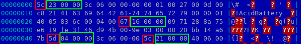
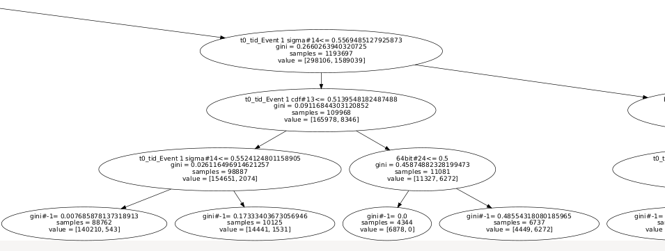
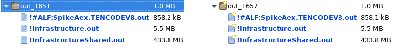

# Windows Defender's VDM Format

The Microsoft Windows Defender antivirus, MpEngine, database is made of several files:
* `mpasbase.vdm`: the AntiSpyware database
* `mpavbase.vdm`: the AntiVirus database
* `mpasdlta.vdm`: the AntiSpyware recent changes ("delta") database
* `mpavdlta.vdm`: the AntiVirus recent changes ("delta") database
* `NisBase.vdm` and `NisFull.vdm`: NisSrv (NIDS) databases, out of the scope of this article

In this article, I try to introduce the VDM file format used by MpEngine. Through the journey, the following point will be discussed:
* VDM file format
* Signature types
    * A zoom on some of them, with a demo of signature escaping
* "dlta" format
    * We'll use this knowledge to diff an hourly update

This article is based solely on static and dynamic MpEngine analysis, with public PDB symbols. Some assumptions might be wrong, and I would be pleased to incorporate your corrections :)

## VDM file format

### Decompressing

The VDM files are PE with a dedicated resource. This whole part is already explained and implement in [WDExtract](https://github.com/hfiref0x/WDExtract).

This process is naively implemented in the following script:
```python
import sys
import zlib
import struct

# Get VDM data
data = open(sys.argv[1], "rb").read()
# Look for the resource signature
base = data.index(b"RMDX")
# Extract relevant information
offset, size = struct.unpack("II", data[base + 0x18: base + 0x20])
# Decompress the data
x = zlib.decompress(data[base + offset + 8:], -15)
# Ensure correctness
assert len(x) == size
# Dumps the output
open("%s.extracted" % sys.argv[1], "wb").write(x)
```

In `mpengine.dll`, this process is implemented in:
```
modprobe_init ()
    modprobe_init_worker ()
        load_database(void *) ()
            DispatchProxy::ConsumeInput(void *,ulong,ulong,ulong,wchar_t const *) ()
                DispatchProxy::ConsumeInputCompressed(void *,ulong,ulong,ulong,wchar_t const *) ()
```

The file signature was previously checked with a call to `preload_database()`.
Interestingly, there is a preload of `mpinternal.vdm`, an undocumented and absent VDM database. It is likely used for MpEngine development inside Microsoft.

### Signature format

The data format of the decompressed stream is, to the best of my knowledge, undocumented publicly.

The stream is parsed in `DispatchRecords`, which might call `DispatchRecord`. The format is actually a quite simple Type-Length-Value one:
```C
struct {
    uint8_t sig_type;
    uint8_t size_low;
    uint16_t size_high;
    uint8_t value[size_low | size_high << 8];
} sig_entry;
```

Here is an example of an actual decompressed VDM file:


Some of the signature type's name are listed in the debugging-purpose `getsigtype` function. The element in the list changes from version to another, but here is an extraction example:
```python
SIG_TYPES = {
    1: "SIGNATURE_TYPE_RESERVED",
    2: "SIGNATURE_TYPE_VOLATILE_THREAT_INFO",
    3: "SIGNATURE_TYPE_VOLATILE_THREAT_ID",
    17: "SIGNATURE_TYPE_CKOLDREC",
    32: "SIGNATURE_TYPE_KVIR32",
    33: "SIGNATURE_TYPE_POLYVIR32",
    39: "SIGNATURE_TYPE_NSCRIPT_NORMAL",
    40: "SIGNATURE_TYPE_NSCRIPT_SP",
    41: "SIGNATURE_TYPE_NSCRIPT_BRUTE",
    44: "SIGNATURE_TYPE_NSCRIPT_CURE",
    48: "SIGNATURE_TYPE_TITANFLT",
    61: "SIGNATURE_TYPE_PEFILE_CURE",
    62: "SIGNATURE_TYPE_MAC_CURE",
    64: "SIGNATURE_TYPE_SIGTREE",
    65: "SIGNATURE_TYPE_SIGTREE_EXT",
    66: "SIGNATURE_TYPE_MACRO_PCODE",
    67: "SIGNATURE_TYPE_MACRO_SOURCE",
    68: "SIGNATURE_TYPE_BOOT",
    73: "SIGNATURE_TYPE_CLEANSCRIPT",
    74: "SIGNATURE_TYPE_TARGET_SCRIPT",
    80: "SIGNATURE_TYPE_CKSIMPLEREC",
    81: "SIGNATURE_TYPE_PATTMATCH",
    83: "SIGNATURE_TYPE_RPFROUTINE",
    85: "SIGNATURE_TYPE_NID",
    86: "SIGNATURE_TYPE_GENSFX",
    87: "SIGNATURE_TYPE_UNPLIB",
    88: "SIGNATURE_TYPE_DEFAULTS",
    91: "SIGNATURE_TYPE_DBVAR",
    92: "SIGNATURE_TYPE_THREAT_BEGIN",
    93: "SIGNATURE_TYPE_THREAT_END",
    94: "SIGNATURE_TYPE_FILENAME",
    95: "SIGNATURE_TYPE_FILEPATH",
    96: "SIGNATURE_TYPE_FOLDERNAME",
    97: "SIGNATURE_TYPE_PEHSTR",
    98: "SIGNATURE_TYPE_LOCALHASH",
    99: "SIGNATURE_TYPE_REGKEY",
    100: "SIGNATURE_TYPE_HOSTSENTRY",
    103: "SIGNATURE_TYPE_STATIC",
    105: "SIGNATURE_TYPE_LATENT_THREAT",
    106: "SIGNATURE_TYPE_REMOVAL_POLICY",
    107: "SIGNATURE_TYPE_WVT_EXCEPTION",
    108: "SIGNATURE_TYPE_REVOKED_CERTIFICATE",
    112: "SIGNATURE_TYPE_TRUSTED_PUBLISHER",
    113: "SIGNATURE_TYPE_ASEP_FILEPATH",
    115: "SIGNATURE_TYPE_DELTA_BLOB",
    116: "SIGNATURE_TYPE_DELTA_BLOB_RECINFO",
    117: "SIGNATURE_TYPE_ASEP_FOLDERNAME",
    119: "SIGNATURE_TYPE_PATTMATCH_V2",
    120: "SIGNATURE_TYPE_PEHSTR_EXT",
    121: "SIGNATURE_TYPE_VDLL_X86",
    122: "SIGNATURE_TYPE_VERSIONCHECK",
    123: "SIGNATURE_TYPE_SAMPLE_REQUEST",
    124: "SIGNATURE_TYPE_VDLL_X64",
    126: "SIGNATURE_TYPE_SNID",
    127: "SIGNATURE_TYPE_FOP",
    128: "SIGNATURE_TYPE_KCRCE",
    131: "SIGNATURE_TYPE_VFILE",
    132: "SIGNATURE_TYPE_SIGFLAGS",
    133: "SIGNATURE_TYPE_PEHSTR_EXT2",
    134: "SIGNATURE_TYPE_PEMAIN_LOCATOR",
    135: "SIGNATURE_TYPE_PESTATIC",
    136: "SIGNATURE_TYPE_UFSP_DISABLE",
    137: "SIGNATURE_TYPE_FOPEX",
    138: "SIGNATURE_TYPE_PEPCODE",
    139: "SIGNATURE_TYPE_IL_PATTERN",
    140: "SIGNATURE_TYPE_ELFHSTR_EXT",
    141: "SIGNATURE_TYPE_MACHOHSTR_EXT",
    142: "SIGNATURE_TYPE_DOSHSTR_EXT",
    143: "SIGNATURE_TYPE_MACROHSTR_EXT",
    144: "SIGNATURE_TYPE_TARGET_SCRIPT_PCODE",
    145: "SIGNATURE_TYPE_VDLL_IA64",
    149: "SIGNATURE_TYPE_PEBMPAT",
    150: "SIGNATURE_TYPE_AAGGREGATOR",
    151: "SIGNATURE_TYPE_SAMPLE_REQUEST_BY_NAME",
    152: "SIGNATURE_TYPE_REMOVAL_POLICY_BY_NAME",
    153: "SIGNATURE_TYPE_TUNNEL_X86",
    154: "SIGNATURE_TYPE_TUNNEL_X64",
    155: "SIGNATURE_TYPE_TUNNEL_IA64",
    156: "SIGNATURE_TYPE_VDLL_ARM",
    157: "SIGNATURE_TYPE_THREAD_X86",
    158: "SIGNATURE_TYPE_THREAD_X64",
    159: "SIGNATURE_TYPE_THREAD_IA64",
    160: "SIGNATURE_TYPE_FRIENDLYFILE_SHA256",
    161: "SIGNATURE_TYPE_FRIENDLYFILE_SHA512",
    162: "SIGNATURE_TYPE_SHARED_THREAT",
    163: "SIGNATURE_TYPE_VDM_METADATA",
    164: "SIGNATURE_TYPE_VSTORE",
    165: "SIGNATURE_TYPE_VDLL_SYMINFO",
    166: "SIGNATURE_TYPE_IL2_PATTERN",
    167: "SIGNATURE_TYPE_BM_STATIC",
    168: "SIGNATURE_TYPE_BM_INFO",
    169: "SIGNATURE_TYPE_NDAT",
    170: "SIGNATURE_TYPE_FASTPATH_DATA",
    171: "SIGNATURE_TYPE_FASTPATH_SDN",
    172: "SIGNATURE_TYPE_DATABASE_CERT",
    173: "SIGNATURE_TYPE_SOURCE_INFO",
    174: "SIGNATURE_TYPE_HIDDEN_FILE",
    175: "SIGNATURE_TYPE_COMMON_CODE",
    176: "SIGNATURE_TYPE_VREG",
    177: "SIGNATURE_TYPE_NISBLOB",
    178: "SIGNATURE_TYPE_VFILEEX",
    179: "SIGNATURE_TYPE_SIGTREE_BM",
    180: "SIGNATURE_TYPE_VBFOP",
    181: "SIGNATURE_TYPE_VDLL_META",
    182: "SIGNATURE_TYPE_TUNNEL_ARM",
    183: "SIGNATURE_TYPE_THREAD_ARM",
    184: "SIGNATURE_TYPE_PCODEVALIDATOR",
    186: "SIGNATURE_TYPE_MSILFOP",
    187: "SIGNATURE_TYPE_KPAT",
    188: "SIGNATURE_TYPE_KPATEX",
    189: "SIGNATURE_TYPE_LUASTANDALONE",
    190: "SIGNATURE_TYPE_DEXHSTR_EXT",
    191: "SIGNATURE_TYPE_JAVAHSTR_EXT",
    192: "SIGNATURE_TYPE_MAGICCODE",
    193: "SIGNATURE_TYPE_CLEANSTORE_RULE",
    194: "SIGNATURE_TYPE_VDLL_CHECKSUM",
    195: "SIGNATURE_TYPE_THREAT_UPDATE_STATUS",
    196: "SIGNATURE_TYPE_VDLL_MSIL",
    197: "SIGNATURE_TYPE_ARHSTR_EXT",
    198: "SIGNATURE_TYPE_MSILFOPEX",
    199: "SIGNATURE_TYPE_VBFOPEX",
    200: "SIGNATURE_TYPE_FOP64",
    201: "SIGNATURE_TYPE_FOPEX64",
    202: "SIGNATURE_TYPE_JSINIT",
    203: "SIGNATURE_TYPE_PESTATICEX",
    204: "SIGNATURE_TYPE_KCRCEX",
    205: "SIGNATURE_TYPE_FTRIE_POS",
    206: "SIGNATURE_TYPE_NID64",
    207: "SIGNATURE_TYPE_MACRO_PCODE64",
    208: "SIGNATURE_TYPE_BRUTE",
    209: "SIGNATURE_TYPE_SWFHSTR_EXT",
    210: "SIGNATURE_TYPE_REWSIGS",
    211: "SIGNATURE_TYPE_AUTOITHSTR_EXT",
    212: "SIGNATURE_TYPE_INNOHSTR_EXT",
    213: "SIGNATURE_TYPE_ROOTCERTSTORE",
    214: "SIGNATURE_TYPE_EXPLICITRESOURCE",
    215: "SIGNATURE_TYPE_CMDHSTR_EXT",
    216: "SIGNATURE_TYPE_FASTPATH_TDN",
    217: "SIGNATURE_TYPE_EXPLICITRESOURCEHASH",
    218: "SIGNATURE_TYPE_FASTPATH_SDN_EX",
    219: "SIGNATURE_TYPE_BLOOM_FILTER",
    220: "SIGNATURE_TYPE_RESEARCH_TAG",
    222: "SIGNATURE_TYPE_ENVELOPE",
    223: "SIGNATURE_TYPE_REMOVAL_POLICY64",
    224: "SIGNATURE_TYPE_REMOVAL_POLICY64_BY_NAME",
    225: "SIGNATURE_TYPE_VDLL_META_X64",
    226: "SIGNATURE_TYPE_VDLL_META_ARM",
    227: "SIGNATURE_TYPE_VDLL_META_MSIL",
    228: "SIGNATURE_TYPE_MDBHSTR_EXT",
    229: "SIGNATURE_TYPE_SNIDEX",
    230: "SIGNATURE_TYPE_SNIDEX2",
    231: "SIGNATURE_TYPE_AAGGREGATOREX",
    232: "SIGNATURE_TYPE_PUA_APPMAP",
    233: "SIGNATURE_TYPE_PROPERTY_BAG",
    234: "SIGNATURE_TYPE_DMGHSTR_EXT",
    235: "SIGNATURE_TYPE_DATABASE_CATALOG",
}
```

So the file above can be parsed as:
```
SIGNATURE_TYPE_THREAT_BEGIN (0x23)
0000  3c 06 00 00 00 00 01 00 27 00 0d 00 c8 21 41 63   <.......'....!Ac
0010  69 64 42 61 74 74 65 72 79 00 00 01 40 05 83 6c   idBattery...@..l
0020  00 04 00                                          ...

SIGNATURE_TYPE_STATIC (0x16)
0000  09 71 28 8a 75 e6 19 fe 3f 46 d9 4b 00 9e 03 00   .q(.u...?F.K....
0010  00 20 bb 14 a6 7b                                 . ...{

SIGNATURE_TYPE_THREAT_END (0x4)
0000  3c 06 00 00                                       <...

SIGNATURE_TYPE_THREAT_BEGIN (0x21)
0000  40 06 00 00 00 00 01 00 04 00 0b 00 88 21 41 63   @............!Ac
0010  69 64 52 65 69 67 6e 00 00 02 40 05 83 5c 00 04   idReign...@..\..
0020  00                                                .
...
```

### Handling in the code

To understand how each of these signature works, one can look at how they are handled by the code.

The highlevel process is the following:
1. In `modprobe_init_worker`, the `init_modules` function is called
2. This function call `AutoInitModules::AutoInitModules` with the list of module to init
3. For each module, an initialisation function will be called
4. This initialisation function could:
* Call `ResmgrRegisterPlugin(ResmgrPluginTemplateT const *)` (188 / 377 modules)
* Call `RegisterUfsPlugin(UfsPluginTemplateInfo const *)` (71 / 377 modules)
    * A structure is given in parameters, including a *ismine* function. For example, the `pdf_init_module` use `UfsPluginBase * nUFSP_pdf::IsMine(struct SCAN_REPLY *, class UfsPluginBase *)`, which will be called during scans check for `%PDF` among other things  
* Call `RegisterForDatabaseVar(struct DBVarType *info, enum MP_ERROR (__stdcall __high *notification_callback)(void *), void *unknown)` (6 / 377 modules)
* **Call `regcntl` with a signature type and an "init" and "destroy" callbacks**
  * These callbacks are registered in the global `kernel table` structure

For instance, in MpEngine version `1.1.15600.4`, the module list is:

7z, AMSI, AMSIUAC, Activesetupcomponent, Activex, AlternateShell, Appinitdll, Appmodel, Appsecdll, AsyncProcessScan, AsyncResourceScan, AttributePersistContext, AutoIT, AutodialDLL, AutoitScan, Autorun, AutorunInf, BackupStore, Behavior, Bho, BmController, BmSignatureLoader, BondSerializer, Boot, BootRecordCleanStore, Bootexec, Bootsyncblock, Bootverification, Class, CleanFileTelemetry, CleanStore, Clsid, CmdLine, Commandline, Containerfile, Contextmenu, Copyhookhandler, DT_env, Datahandler, Desktopcomponent, Dragdrophandler, Driver, Drophandler, DumpFile, DynamicConfig, EPOC, Expooffload, Extension, File, Filelocalcopy, Findextension, Firewallokfile, Firewallport, Folder, Fontdriver, GenStream, Ginadll, Gpextension, Hiddendriver, Hiddenfile, HookWow, IL_x86, Iconhandler, Ieabout, Ieaddon, Iedragdrop, Ieelevationpolicy, Ieexplorerbar, Ieext, Ieextapproved, Iemain, Iemenuext, Iephishingfilter, Ieplugin, Iepreapproved, Iesearch, Iesearchscope, Iesearchurl, Ieshellbrowser, Ietoolbar, Ieurlsearchhook, Ievext, Iewebbrowser, Imagefileexecoptions, Infotiphandler, Inifilemap, InnoScan, Interface, InternalAMSI, InternalAMSIUAC, InternalBootsyncblock, InternalGenStream, Internalbehavior, Internalwebscript, Jitdebugger, Knowndll, Knowndll16, LUA, Linkhandler, Lsapackage, Lsp, LuaStandalone, Moduleusage, NET_IL, NetworkHips, Nsp, Ntappdll, Ntrunkey, Pendfile, PersistedStore, Policyscript, Postsignatureupdatescan, Poststartupscan, Printmonitor, Printprovider, Process, ProcessExclusions, ProcessMemoryScan, Propertyhandler, Propertysheethandler, Protocolfilter, Protocolhandler, Protocolhandlerversion, Protocolnamespacehandler, Pseudorunkey, QueryFileCmdLine, QueryFileHookwow, QueryfileAMSI, QueryfileAMSIUAC, QueryfileGenStream, Queryfilebootrtsig, Queryfilebootsync, Queryfileprocessrtsig, Queryfileregkeyvalue, Queryfilertsig, Queryfilewebscript, Regkey, Regkeyvalue, RemapErrorCode, Remediationcheckpoint, ReplayableContainer, ResSMS, Restrictrun, RootCert, RootCertUser, Rootkit, Rootkittelemetry, Runkey, Runonce, Runonceex, SMS, Safeboot, Samplefileelamfile, Samplefilehidden, Samplefilerecalled, Samplefilerootkit, Samplefilesubmissiononly, Screensaver, Secprovider, Service, Shareddll, Sharedtaskscheduler, Shellcolumnhandler, Shellexechook, Shellextapproved, Shelliconoverlayid, Shellopencmd, Shellserviceobjectdelayload, SilentProcessExit, Specialfolder, SpynetSigLoader, Startup, Structstoragehandler, Subsystem, Subsystemtype, Taskscheduler, Thread, Thumbnailhandler, Transactionfile, Tsstartup, Typelib, Typelibversion, Ufs, Uninstall, UserInitMprLogonScript, Usershellfolder, Wallpaper, Webfile, Webscript, Winlognotif, Winlogonshell, Winlogonsystem, Winlogontaskman, Winlogonuihost, Winlogonuserinit, ace, actions, adaptivesyncquery, adotout, advsamplesubmissionmanager, aggregator, amsisessioncache, amunpacker, appcompatshim, appv, ar, arc, arj, asad, asyncwork, autoconfigurl, badrecs, bga, bh, bhourlwl, binhex, bmsearch, boot, btrtelemetry, c2rdat, cab, cf, chm, chmitss, chromeextensions, chromeinstall, cksig, cpio, cpt, datafile, dbload, dbvars, dbx, dex, dfsp, diagnosticscan, dllimports, dssspynetcontext, dummybin, dzip, eadata, earlyboot, elam, elamfile, elf, emb1, ems, expk, fastpath, filesstash, fileutils, filteredtrie, firefoxextensions, firefoxinstall, firefoxplugins, folderguard, friendlyhelper, fsd, hap, hips, hlp, hookwow, html, image, inno, instcrea, internalCmdLine, internalioavstream, ioavstream, ishld, ishldnew, isu, java, joy, kcrce, kstore, kv16, lelx, lh, lmdb, logskip, macappl, macho, machofat, macro, magiccode, maintenancewindowhelper, mapistub, mapistubdefault, mar, mbasic, mbx, menuetbin, metastore, metastorelowficache, mimen, mkplbox, mkplboxsfx, mof, native, nbinder, ncfile, netvm, notemgr, nscript, nsis, nsv1, ole2, onenote, palm, pattmatch, payloadmgr, pdf, pefile, proc, profilemgr, psf, pst, quantum, queryfileioavstream, queryfilewmi, rar, rar5, regnotemgr, rempol, resmgr, resutils, reswmi, retarget, rtfn, samplereq, sect, sfcbuild, sft, sigroutine, sigtree, sit, sqlitewrapper, strm, submissionrequest, svfohigh, svfolow, swf, symbsis, syncquery, sysclean, sysio, systemfilecachefile, tar, taskmanager, tbb, tcg, test_DT, threathashevent, threatmgr, tnef, trojan, trustedcontent, tunnel, ubermgr, udf, unicode, unplib, validatetrust, vemulib, vfz, vlib, wim, windowscontainers, wise, wmisensorconfig, word2, wpc, x86_IL, xar, zip, zoo

While a lot of this modules sounds promising to analyze, they are out of scope of this article.

Once modules initialization are done, the VDM files are parsed.
On a signature entry parsing, the `DispatchRecord` function will call the callback registered with `regcntl` if the current entry has one of this callback. Otherwise, it will default on `ReceiveNewTemplate`.

For instance, `nscript_init_module` (likely related to JS emulation) registers `pushSP` on signature type `0x28`. According to the above listing, this correspond to `SIGNATURE_TYPE_NSCRIPT_SP`.
Later, when the VDM is actually parsed, `pushSP` will be called on signature with type 0x28. The callstack might looks like:
```
#1 pushSP(void *,uchar const *,uint,ulong,ulong) ()
#2 DispatchRecord ()
#3 DispatchRecords ()
#4 DispatchProxy::Flush(ulong) ()
#5 DispatchProxy::ConsumeInputCompressed(void *,ulong,ulong,ulong,wchar_t const *) ()
#6 DispatchProxy::ConsumeInput(void *,ulong,ulong,ulong,wchar_t const *) ()
#7 load_database(void *) ()
#8 modprobe_init_worker ()
#9 modprobe_init ()
```

These callbacks are responsible for metadata parsing, Lua script enrollment, etc.
In each signature, a CRC and a SHA1 of the signature content are computed. They are likely used to identify a signature entry as a record, made by `createrecid`.

## Example of signature type

As an example, here is the repartition of signature type for a given version:

* `mpasbase`

| Signature type                        | Occurences |
|---------------------------------------|------------|
| SIGNATURE_TYPE_KCRCE                  |     867813 |
| SIGNATURE_TYPE_SNID                   |     704044 |
| SIGNATURE_TYPE_STATIC                 |     192461 |
| SIGNATURE_TYPE_FRIENDLYFILE_SHA256    |     101052 |
| SIGNATURE_TYPE_REVOKED_CERTIFICATE    |      75942 |
| SIGNATURE_TYPE_PESTATIC               |      73794 |
| SIGNATURE_TYPE_NSCRIPT_BRUTE          |      26478 |
| SIGNATURE_TYPE_NID                    |      24103 |
| SIGNATURE_TYPE_THREAT_BEGIN           |      22254 |
| SIGNATURE_TYPE_THREAT_END             |      22254 |
| SIGNATURE_TYPE_TRUSTED_PUBLISHER      |      13011 |
| SIGNATURE_TYPE_PEHSTR_EXT             |      11058 |
| SIGNATURE_TYPE_NID64                  |       9123 |
| SIGNATURE_TYPE_MACRO_PCODE64          |       8644 |
| SIGNATURE_TYPE_LUASTANDALONE          |       8536 |
| SIGNATURE_TYPE_SIGTREE                |       6035 |
| SIGNATURE_TYPE_SNIDEX2                |       6001 |
| SIGNATURE_TYPE_VDLL_META              |       5456 |
| SIGNATURE_TYPE_BRUTE                  |       5157 |
| SIGNATURE_TYPE_VERSIONCHECK           |       5098 |
| SIGNATURE_TYPE_FOLDERNAME             |       4838 |
| SIGNATURE_TYPE_AAGGREGATOREX          |       4745 |
| SIGNATURE_TYPE_NDAT                   |       4580 |
| SIGNATURE_TYPE_AAGGREGATOR            |       4493 |
| SIGNATURE_TYPE_REGKEY                 |       3808 |
| SIGNATURE_TYPE_VREG                   |       3251 |
| SIGNATURE_TYPE_KVIR32                 |       3202 |
| SIGNATURE_TYPE_FOPEX                  |       2444 |
| SIGNATURE_TYPE_PEBMPAT                |       2421 |
| SIGNATURE_TYPE_FILEPATH               |       2113 |
| SIGNATURE_TYPE_PEHSTR                 |       1825 |
| SIGNATURE_TYPE_MACROHSTR_EXT          |       1306 |
| SIGNATURE_TYPE_ASEP_FILEPATH          |       1181 |
| SIGNATURE_TYPE_FOP                    |       1079 |
| SIGNATURE_TYPE_VDLL_META_X64          |       1015 |
| SIGNATURE_TYPE_NSCRIPT_NORMAL         |        911 |
| SIGNATURE_TYPE_JAVAHSTR_EXT           |        887 |
| SIGNATURE_TYPE_SIGTREE_EXT            |        845 |
| SIGNATURE_TYPE_VDLL_X86               |        756 |
| SIGNATURE_TYPE_NSCRIPT_SP             |        573 |
| SIGNATURE_TYPE_PEFILE_CURE            |        499 |
| SIGNATURE_TYPE_COMMON_CODE            |        381 |
| SIGNATURE_TYPE_MACHOHSTR_EXT          |        342 |
| SIGNATURE_TYPE_DEFAULTS               |        317 |
| SIGNATURE_TYPE_SIGTREE_BM             |        237 |
| SIGNATURE_TYPE_DBVAR                  |        215 |
| SIGNATURE_TYPE_REMOVAL_POLICY_BY_NAME |        204 |
| SIGNATURE_TYPE_PATTMATCH              |        191 |
| SIGNATURE_TYPE_VDLL_X64               |        170 |
| SIGNATURE_TYPE_CLEANSCRIPT            |        147 |
| SIGNATURE_TYPE_CKSIMPLEREC            |        145 |
| SIGNATURE_TYPE_IL2_PATTERN            |        140 |
| SIGNATURE_TYPE_VFILE                  |        127 |
| SIGNATURE_TYPE_PUA_APPMAP             |        123 |
| SIGNATURE_TYPE_PEMAIN_LOCATOR         |        121 |
| SIGNATURE_TYPE_CMDHSTR_EXT            |         92 |
| SIGNATURE_TYPE_ARHSTR_EXT             |         75 |
| SIGNATURE_TYPE_HOSTSENTRY             |         65 |
| SIGNATURE_TYPE_CLEANSTORE_RULE        |         61 |
| SIGNATURE_TYPE_MSILFOP                |         59 |
| SIGNATURE_TYPE_REMOVAL_POLICY         |         53 |
| SIGNATURE_TYPE_GENSFX                 |         47 |
| SIGNATURE_TYPE_ELFHSTR_EXT            |         42 |
| SIGNATURE_TYPE_KPATEX                 |         41 |
| SIGNATURE_TYPE_SWFHSTR_EXT            |         39 |
| SIGNATURE_TYPE_FOP64                  |         35 |
| SIGNATURE_TYPE_DEXHSTR_EXT            |         34 |
| SIGNATURE_TYPE_AUTOITHSTR_EXT         |         29 |
| SIGNATURE_TYPE_KPAT                   |         27 |
| SIGNATURE_TYPE_VFILEEX                |         16 |
| SIGNATURE_TYPE_NSCRIPT_CURE           |         15 |
| SIGNATURE_TYPE_UNPLIB                 |         15 |
| SIGNATURE_TYPE_MACRO_SOURCE           |         14 |
| SIGNATURE_TYPE_BOOT                   |         13 |
| SIGNATURE_TYPE_FOPEX64                |         11 |
| SIGNATURE_TYPE_VDLL_MSIL              |         10 |
| SIGNATURE_TYPE_RPFROUTINE             |         10 |
| SIGNATURE_TYPE_THREAD_X86             |         10 |
| SIGNATURE_TYPE_MAGICCODE              |          9 |
| SIGNATURE_TYPE_VBFOP                  |          4 |
| SIGNATURE_TYPE_FTRIE_POS              |          4 |
| SIGNATURE_TYPE_BM_INFO                |          4 |
| SIGNATURE_TYPE_BLOOM_FILTER           |          3 |
| SIGNATURE_TYPE_THREAT_UPDATE_STATUS   |          3 |
| SIGNATURE_TYPE_MACRO_PCODE            |          2 |
| SIGNATURE_TYPE_JSINIT                 |          1 |
| SIGNATURE_TYPE_REWSIGS                |          1 |
| SIGNATURE_TYPE_DMGHSTR_EXT            |          1 |
| SIGNATURE_TYPE_TITANFLT               |          1 |
| SIGNATURE_TYPE_ROOTCERTSTORE          |          1 |
| SIGNATURE_TYPE_TARGET_SCRIPT_PCODE    |          1 |
| SIGNATURE_TYPE_LATENT_THREAT          |          1 |
| SIGNATURE_TYPE_CKOLDREC               |          1 |
| SIGNATURE_TYPE_VBFOPEX                |          1 |

* `mpavbase`

| Signature type                     | Occurences |
|------------------------------------|------------|
| SIGNATURE_TYPE_STATIC              |    1761324 |
| SIGNATURE_TYPE_KCRCE               |     233635 |
| SIGNATURE_TYPE_THREAT_END          |     171967 |
| SIGNATURE_TYPE_THREAT_BEGIN        |     171967 |
| SIGNATURE_TYPE_SNID                |      67905 |
| SIGNATURE_TYPE_PESTATIC            |      63862 |
| SIGNATURE_TYPE_CKSIMPLEREC         |      22301 |
| SIGNATURE_TYPE_NSCRIPT_SP          |      21110 |
| SIGNATURE_TYPE_PEHSTR_EXT          |      18854 |
| SIGNATURE_TYPE_NID                 |      16684 |
| SIGNATURE_TYPE_MACRO_SOURCE        |      13583 |
| SIGNATURE_TYPE_NSCRIPT_BRUTE       |      12181 |
| SIGNATURE_TYPE_NSCRIPT_NORMAL      |       8861 |
| SIGNATURE_TYPE_AAGGREGATOREX       |       4227 |
| SIGNATURE_TYPE_SIGTREE_BM          |       4065 |
| SIGNATURE_TYPE_SIGTREE             |       4026 |
| SIGNATURE_TYPE_KVIR32              |       3393 |
| SIGNATURE_TYPE_PEHSTR              |       3384 |
| SIGNATURE_TYPE_VERSIONCHECK        |       3374 |
| SIGNATURE_TYPE_MACRO_PCODE64       |       3010 |
| SIGNATURE_TYPE_MACRO_PCODE         |       2433 |
| SIGNATURE_TYPE_MACROHSTR_EXT       |       2159 |
| SIGNATURE_TYPE_CKOLDREC            |       1740 |
| SIGNATURE_TYPE_AAGGREGATOR         |       1604 |
| SIGNATURE_TYPE_FOLDERNAME          |       1211 |
| SIGNATURE_TYPE_BOOT                |       1203 |
| SIGNATURE_TYPE_REVOKED_CERTIFICATE |        994 |
| SIGNATURE_TYPE_SIGTREE_EXT         |        989 |
| SIGNATURE_TYPE_BM_INFO             |        664 |
| SIGNATURE_TYPE_NDAT                |        438 |
| SIGNATURE_TYPE_ARHSTR_EXT          |        420 |
| SIGNATURE_TYPE_FOP                 |        417 |
| SIGNATURE_TYPE_FOPEX               |        369 |
| SIGNATURE_TYPE_FILEPATH            |        332 |
| SIGNATURE_TYPE_DEFAULTS            |        313 |
| SIGNATURE_TYPE_PEBMPAT             |        290 |
| SIGNATURE_TYPE_DEXHSTR_EXT         |        248 |
| SIGNATURE_TYPE_BRUTE               |        241 |
| SIGNATURE_TYPE_REGKEY              |        228 |
| SIGNATURE_TYPE_MACHOHSTR_EXT       |        224 |
| SIGNATURE_TYPE_KPAT                |        182 |
| SIGNATURE_TYPE_JAVAHSTR_EXT        |        171 |
| SIGNATURE_TYPE_CMDHSTR_EXT         |        163 |
| SIGNATURE_TYPE_LUASTANDALONE       |        161 |
| SIGNATURE_TYPE_AUTOITHSTR_EXT      |        151 |
| SIGNATURE_TYPE_POLYVIR32           |        151 |
| SIGNATURE_TYPE_CLEANSCRIPT         |        147 |
| SIGNATURE_TYPE_NID64               |        139 |
| SIGNATURE_TYPE_ASEP_FILEPATH       |        121 |
| SIGNATURE_TYPE_THREAD_X86          |        103 |
| SIGNATURE_TYPE_ELFHSTR_EXT         |         89 |
| SIGNATURE_TYPE_KPATEX              |         83 |
| SIGNATURE_TYPE_FOPEX64             |         53 |
| SIGNATURE_TYPE_MSILFOP             |         33 |
| SIGNATURE_TYPE_FOP64               |         13 |
| SIGNATURE_TYPE_VBFOP               |          2 |
| SIGNATURE_TYPE_EXPLICITRESOURCE    |          1 |
| SIGNATURE_TYPE_DOSHSTR_EXT         |          1 |
| SIGNATURE_TYPE_INNOHSTR_EXT        |          1 |
| SIGNATURE_TYPE_DMGHSTR_EXT         |          1 |

### THREAT_BEGIN / THREAT_END

Each signature entries belongs to a *threat*. This *threat* starts with a `SIGNATURE_TYPE_THREAT_BEGIN` entry, indicating the name of the threat, an uniq id, etc. and ends with a `SIGNATURE_TYPE_THREAT_END`.

A *threat* could contains one or several signature entries.
For instance, the listing in the first part of this article shows one static signature relative to the `!AcidBattery` threat.

But not all the threat are made equals; while the vast majority of threat are relative to actual malware detection, a few of them seems to have specials purposes:

* `FriendlyFiles`: made of 100 000+ `SIGNATURE_TYPE_FRIENDLYFILE_SHA256` entries, such as:
```
SIGNATURE_TYPE_FRIENDLYFILE_SHA256
0000  01 ec e1 b7 3c ee 9e 95 b4 6c f7 56 6c c5 d9 32   ....<....l.Vl..2
0010  80 fd e6 b4 cc 18 43 ac 66 d5 d8 ae 44 31 68 34   ......C.f...D1h4
```
Which seems to be [kprometheus.dll](https://www.virustotal.com/gui/file/01ece1b73cee9e95b46cf7566cc5d93280fde6b4cc1843ac66d5d8ae44316834/detection).
* `!Infrastructure`: contains `SIGNATURE_TYPE_CLEANSCRIPT`, `SIGNATURE_TYPE_DEFAULTS` and `SIGNATURE_TYPE_TRUSTED_PUBLISHER`
* `!InfrastructureShared`: from far the biggest *threat*. From my understanding, this is where the commons are (shared Lua scripts for instance), and where the detection logics resides (with `SIGNATURE_TYPE_SIGTREE` and `SIGNATURE_TYPE_RPFROUTINE` for instance)

Interestingly, some threats have names which are not looking like actual malware id: `!#attrmatch_codepatch_eip_00000000_39c0`, `!#ChangeEPtoExport`, `!#do_deep_rescan`, `!#do_exhaustivehstr_rescan`, `!#do_vmmgrow_rescan`, `!#loop_self`, `#MpProjectAttribute`, `!#MpRequestHookwowH`, `!#MpRequestHookwowM`, `!#MustEmulateTest`, `!#PDF_ScanAllStreams`, `!#rpcss.pdb`, ...

### VDLL*

These signatures belongs to the `!InfrastructureShared` threat.

They correspond to the Virtual DLL used during the emulation phase. One can found more details about them in the [Windows Defender Antivirus' binary emulator](https://github.com/0xAlexei/WindowsDefenderTools) presentations of @0xAlexei. They are easily extractable through [WDExtract](https://github.com/hfiref0x/WDExtract).

It regroups:
* `SIGNATURE_TYPE_VDLL_X86`: 32 bit emulation
* `SIGNATURE_TYPE_VDLL_X64`: 64 bit emulation
* `SIGNATURE_TYPE_VDLL_MSIL`: .NET dlls
* `SIGNATURE_TYPE_VDLL_META` and `SIGNATURE_TYPE_VDLL_META_X64`: DLL's metadata

Note that `SIGNATURE_TYPE_VDLL_META_ARM` also exists, but were not observed.

Some of this DLL also contains specials resources, as described in the [Attack Surface Reduction article](https://github.com/commial/experiments/blob/master/windows-defender/ASR/README.md).

### VFILE*

In the same vain, `SIGNATURE_TYPE_VFILE` and `SIGNATURE_TYPE_VFILEEX` contain custom file for the virtual filesystem.

An example of entry:
```
SIGNATURE_TYPE_VFILE
0000  20 00 00 00 00 44 c9 b3 25 bc d3 01 00 44 c9 b3    ....D..%....D..
0010  25 bc d3 01 00 44 c9 b3 25 bc d3 01 00 00 00 00   %....D..%.......
0020  23 00 00 00 00 00 00 00 00 00 00 00 43 00 3a 00   #...........C.:.
0030  5c 00 4d 00 69 00 72 00 63 00 5c 00 6d 00 69 00   \.M.i.r.c.\.m.i.
0040  72 00 63 00 2e 00 69 00 6e 00 69 00 00 00 00 00   r.c...i.n.i.....
0050  00 00 00 00 00 00 00 00 00 00 00 00 00 00 00 00   ................
...
0240  00 00 00 00 00 00 00 00 00 00 00 00 00 00 00 00   ................
0250  5b 63 68 61 6e 66 6f 6c 64 65 72 5d 0d 0a 6e 30   [chanfolder]..n0
0260  3d 23 42 6c 61 62 6c 61 0d 0a 6e 31 3d 23 45 6e   =#Blabla..n1=#En
0270  64 0d 0a                                          d..
```

Which is a fake mIRC configuration file.

### ROOTCERTSTORE

Only one `SIGNATURE_TYPE_ROOTCERTSTORE` entry is available (in the `!InfrastructureShared` threat).

It contains root CA for `AffirmTrust`, `Amazon Root CA 40`, etc. and are likely used to check for code signing.

### HSTR*

Signature types `HSTR` are strings to look at for malware recognition.

For instance:
* `!BITSAbuse.D` uses a `SIGNATURE_TYPE_CMDHSTR_EXT` to look for `bitsadmin` special arguments
```
SIGNATURE_TYPE_CMDHSTR_EXT
0000  04 00 04 00 04 00 00 01 00 0f 02 63 00 6d 00 64   ...........c.m.d
0010  00 90 02 20 2f 00 63 00 90 00 01 00 29 02 62 00   ... /.c.....).b.
0020  69 00 74 00 73 00 61 00 64 00 6d 00 69 00 6e 00   i.t.s.a.d.m.i.n.
0030  90 02 10 2f 00 74 00 72 00 61 00 6e 00 73 00 66   .../.t.r.a.n.s.f
0040  00 65 00 72 00 90 00 01 00 20 00 63 00 65 00 72   .e.r..... .c.e.r
0050  00 74 00 75 00 74 00 69 00 6c 00 20 00 2d 00 64   .t.u.t.i.l. .-.d
0060  00 65 00 63 00 6f 00 64 00 65 00 01 00 17 02 73   .e.c.o.d.e.....s
0070  00 74 00 61 00 72 00 74 00 90 02 f0 2e 00 65 00   .t.a.r.t......e.
0080  78 00 65 00 90 00 00 00                           x.e.....
```
* `aCVE-2012-0507.D!ldr` uses a `SIGNATURE_TYPE_JAVAHSTR_EXT` to look for strings related to the CVE-2012-0507 exploit:
```
SIGNATURE_TYPE_JAVAHSTR_EXT
0000  22 00 22 00 0d 00 00 05 00 1e 01 6a 61 76 61 2f   "."........java/
0010  73 65 63 75 72 69 74 79 2f 63 65 72 74 2f 43 65   security/cert/Ce
0020  72 74 69 66 69 63 61 74 65 05 00 19 01 6a 61 76   rtificate....jav
0030  61 2f 73 65 63 75 72 69 74 79 2f 50 65 72 6d 69   a/security/Permi
0040  73 73 69 6f 6e 73 05 00 1e 01 6a 61 76 61 2f 73   ssions....java/s
0050  65 63 75 72 69 74 79 2f 50 72 6f 74 65 63 74 69   ecurity/Protecti
0060  6f 6e 44 6f 6d 61 69 6e 05 00 1b 01 6a 61 76 61   onDomain....java
0070  2f 73 65 63 75 72 69 74 79 2f 41 6c 6c 50 65 72   /security/AllPer
0080  6d 69 73 73 69 6f 6e 04 00 17 03 73 65 63 75 72   mission....secur
0090  69 74 79 90 01 01 43 6f 64 65 53 6f 75 72 63 65   ity...CodeSource
00a0  90 00 04 00 17 03 72 65 66 6c 65 63 74 90 01 01   ......reflect...
00b0  43 6f 6e 73 74 72 75 63 74 6f 72 90 00 01 00 07   Constructor.....
00c0  01 6e 65 74 2f 55 52 4c 01 00 0b 01 6e 65 77 49   .net/URL....newI
00d0  6e 73 74 61 6e 63 65 0a 00 08 01 2a b6 05 6c bc   nstance....*..l.
00e0  4c 03 3d 0a 00 12 03 19 b7 3a 2a 12 90 01 01 03   L.=......:*.....
00f0  90 01 01 be 19 b6 3a 90 00 04 00 15 01 6a 61 76   ......:......jav
0100  61 2f 6c 61 6e 67 2f 43 6c 61 73 73 4c 6f 61 64   a/lang/ClassLoad
0110  65 72 e2 ff 19 01 2f 73 65 63 75 72 69 74 79 2f   er..../security/
0120  70 72 6f 76 69 64 65 72 2f 50 6f 6c 69 63 79 e2   provider/Policy.
0130  ff 20 01 4a 45 54 50 6f 6c 69 63 79 5d 20 4a 45   . .JETPolicy] JE
0140  54 50 6f 6c 69 63 79 20 3a 20 65 78 74 20 64 69   TPolicy : ext di
0150  72 20 3a 00 00 20 00                              r :.. .
```
* `!CoinMiner.QP!bit` uses a `SIGNATURE_TYPE_AUTOITHSTR_EXT` to look for AutoIT strings:
```
SIGNATURE_TYPE_AUTOITHSTR_EXT
0000  03 00 03 00 03 00 00 01 00 24 00 73 00 74 00 65   .........$.s.t.e
0010  00 61 00 6d 00 6e 00 65 00 7a 00 6f 00 78 00 40   .a.m.n.e.z.o.x.@
0020  00 6d 00 61 00 69 00 6c 00 2e 00 72 00 75 00 01   .m.a.i.l...r.u..
0030  00 80 00 53 00 48 00 45 00 4c 00 4c 00 45 00 58   ...S.H.E.L.L.E.X
0040  00 45 00 43 00 55 00 54 00 45 00 20 00 28 00 20   .E.C.U.T.E. .(. 
0050  00 22 00 73 00 63 00 68 00 74 00 61 00 73 00 6b   .".s.c.h.t.a.s.k
0060  00 73 00 2e 00 65 00 78 00 65 00 22 00 20 00 2c   .s...e.x.e.". .,
0070  00 20 00 22 00 2f 00 63 00 72 00 65 00 61 00 74   . ."./.c.r.e.a.t
0080  00 65 00 20 00 2f 00 74 00 6e 00 20 00 22 00 22   .e. ./.t.n. ."."
0090  00 5c 00 57 00 69 00 6e 00 64 00 6f 00 77 00 73   .\.W.i.n.d.o.w.s
00a0  00 5c 00 52 00 65 00 63 00 6f 00 76 00 65 00 72   .\.R.e.c.o.v.e.r
00b0  00 79 00 01 00 66 00 46 00 49 00 4c 00 45 00 53   .y...f.F.I.L.E.S
00c0  00 45 00 54 00 41 00 54 00 54 00 52 00 49 00 42   .E.T.A.T.T.R.I.B
00d0  00 20 00 28 00 20 00 40 00 53 00 43 00 52 00 49   . .(. .@.S.C.R.I
00e0  00 50 00 54 00 44 00 49 00 52 00 20 00 26 00 20   .P.T.D.I.R. .&. 
00f0  00 22 00 5c 00 63 00 6f 00 6e 00 66 00 69 00 67   .".\.c.o.n.f.i.g
0100  00 2e 00 6a 00 73 00 6f 00 6e 00 22 00 20 00 2c   ...j.s.o.n.". .,
0110  00 20 00 22 00 2b 00 53 00 2b 00 48 00 00 00      . .".+.S.+.H...
```
* `Trojan:AndroidOS%2FRuFraud.A` uses `SIGNATURE_TYPE_DEXHSTR_EXT` to look for strings in DEX (Android) files:
```
SIGNATURE_TYPE_DEXHSTR_EXT
0000  04 00 03 00 04 00 00 01 00 12 01 39 31 2e 32 31   ...........91.21
0010  33 2e 31 37 35 2e 31 34 38 2f 61 70 70 01 00 13   3.175.148/app...
0020  01 44 6f 77 6e 6c 6f 61 64 69 6e 67 20 66 69 6c   .Downloading fil
0030  65 2e 2e 2e 01 00 20 01 45 32 37 33 46 45 44 38   e..... .E273FED8
0040  34 31 35 46 37 42 31 44 38 43 46 45 41 43 38 30   415F7B1D8CFEAC80
0050  41 39 36 43 46 46 34 36 01 00 19 01 52 75 6c 65   A96CFF46....Rule
0060  41 63 74 69 76 69 74 79 24 64 6f 77 6e 6c 6f 61   Activity$downloa
0070  64 44 61 74 61 00 00                              dData..
```
* `Trojan:O97M%2FFinDropper.H!dha` uses `SIGNATURE_TYPE_MACROHSTR_EXT` to look for strings in Office macro:
```
SIGNATURE_TYPE_MACROHSTR_EXT
0000  04 00 04 00 06 00 00 01 00 22 00 4d 73 67 42 6f   .........".MsgBo
0010  78 20 28 22 44 6f 63 75 6d 65 6e 74 20 64 65 63   x ("Document dec
0020  72 79 70 74 20 65 72 72 6f 72 2e 22 29 01 00 17   rypt error.")...
0030  02 55 73 65 72 46 6f 72 6d 31 2e 90 02 0a 2e 43   .UserForm1.....C
0040  61 70 74 69 6f 6e 90 00 01 00 0f 02 43 68 44 69   aption......ChDi
0050  72 20 90 02 0a 4f 70 65 6e 90 00 01 00 13 02 3d   r ...Open......=
0060  20 49 6e 53 74 72 28 90 02 10 2c 22 3b 3b 22 29    InStr(...,";;")
0070  90 00 01 00 2b 02 46 6f 72 20 69 20 3d 20 90 02   ....+.For i = ..
0080  0a 20 54 6f 20 90 02 0a 3a 20 90 02 0a 20 3d 20   . To ...: ... = 
0090  90 02 0a 20 26 20 90 02 0a 3a 20 4e 65 78 74 90   ... & ...: Next.
00a0  00 01 00 37 02 4f 70 65 6e 20 90 02 10 20 46 6f   ...7.Open ... Fo
00b0  72 20 4f 75 74 70 75 74 20 41 73 20 23 31 39 3a   r Output As #19:
00c0  20 50 72 69 6e 74 20 23 31 39 2c 20 90 02 10 3a    Print #19, ...:
00d0  20 43 6c 6f 73 65 20 23 31 39 90 00 00 00          Close #19....
```

And so on.

### LUA*

Lua parsing and decompiling is already described in the [Attack Surface Reduction article](https://github.com/commial/experiments/blob/master/windows-defender/ASR/README.md).

Additionnaly, when a Lua script is defined, it is attached to a category. This category is retrived in the code through `LookupScriptCategory(int cat_nb)`.

For instance, here is a few category names:
* `Infrastructure`
* `TriggerScan32`
* `KernelScan32`
* `RootkitRemediation32`
* `TriggerScan64`
* `KernelScan64`
* `RootkitRemediation64`
* `PEPREEMU`
* `PEPOSTEMU`
* `PELast`
* `PEFinalizer`
* `GenFirst`
* `GenLast`
* `PreRemediation`
* `PostRemediation`
* `IETrigger`
* `DetectionSpecific`
* etc.

### DBVAR

The `SIGNATURE_TYPE_DBVAR` are located in `!InfrastructureShared` *threat*.

From the author's understanding, they are a way to configure the MpEngine.
They are *(key, value)* elements, with the value's type belonging to one of:
* `DBVAR_RAW`
* `DBVAR_B`
* `DBVAR_W`
* `DBVAR_DW`
* `DBVAR_QW`
* `DBVAR_ARRAY_B`
* `DBVAR_ARRAY_W`
* `DBVAR_ARRAY_DW`
* `DBVAR_ARRAY_QW`
* `DBVAR_STRING`
* `DBVAR_STRINGN`
* `DBVAR_WIDESTRING`
* `DBVAR_WIDESTRINGN`
* `DBVAR_ARRAY_STRING`
* `DBVAR_ARRAY_STRINGN`
* `DBVAR_ARRAY_WIDESTRING`
* `DBVAR_ARRAY_WIDESTRINGN`

Here is an example:
```
SIGNATURE_TYPE_DBVAR
0000  0f 41 6d 73 69 50 72 6f 63 65 73 73 4c 69 73 74   .AmsiProcessList
0010  5e 00 00 00 03 00 00 00 0c 00 00 00 63 00 73 00   ^...........c.s.
0020  63 00 72 00 69 00 70 00 74 00 2e 00 65 00 78 00   c.r.i.p.t...e.x.
0030  65 00 00 00 0f 00 00 00 70 00 6f 00 77 00 65 00   e.......p.o.w.e.
0040  72 00 73 00 68 00 65 00 6c 00 6c 00 2e 00 65 00   r.s.h.e.l.l...e.
0050  78 00 65 00 00 00 0c 00 00 00 77 00 73 00 63 00   x.e.......w.s.c.
0060  72 00 69 00 70 00 74 00 2e 00 65 00 78 00 65 00   r.i.p.t...e.x.e.
0070  00 00 
```

It can be read as:
```
AmsiProcessList = [cscript.exe, powershell.exe, wscript.exe]
```

A few example:
* `CompetitiveSecurityProducts` = `["(r)\\[^\\]*mcafee[^\\]*\\", "%system%\mrt.exe", "(r)\\ascservice.exe$", "(r)^*\\bbcf618-2a81-426d-81ec-[^]+\.exe$", "%programdata%\a1a72074-2e3e-43e5-97bb-dddaae288b19.exe", "%common_appdata%\a1a72074-2e3e-43e5-97bb-dddaae288b19.exe"`
* `AVEngineConfig` = `[.exe,.dll,.ocx,.vbs,.bat,.cmd,.com,.js,.msi,.reg,.shs,.sys,.vb,.vbe,.wsc,.wsf,.wsh,.scr,.asm,.zip,.ini,.pif,.lnk,.htm,.html,.doc,.xls,.ppt,.docx,.pptx,.xlsx,.dot,.xlt,.xml,.bin,.ax,.fon,.chm,.msp,.tlb,.aspx,.asp,.cpl,.drv,.msc,.api,.app,.apl,.aup]`
* `AsrThrottledAudit`= `0x64`
* `TdtCryptoData`: profile, model and DOT version of the random forest trees for [Intel TDT](https://www.microsoft.com/security/blog/2021/04/26/defending-against-cryptojacking-with-microsoft-defender-for-endpoint-and-intel-tdt/)




Some of this variable are surrounded by `SIGNATURE_TYPE_VERSIONCHECK` entries. It might suggest that they are only take in account if the version is matching the ones expected.

As an example :
```
SIGNATURE_TYPE_VERSIONCHECK
0000  31 00 00 00 00 00 00 00                           1.......

SIGNATURE_TYPE_VERSIONCHECK
0000  74 00 00 00 00 00 00 00                           t.......

SIGNATURE_TYPE_DBVAR
0000  0c 4d 70 55 73 65 53 61 6e 64 62 6f 78 04 00 00   .MpUseSandbox...
0010  00 01 00 00 00                                    .....

SIGNATURE_TYPE_VERSIONCHECK
0000  00 00 00 00 00 00 00 00                           ........

SIGNATURE_TYPE_VERSIONCHECK
0000  00 00 00 00 00 00 00 00                           ........
```

(`SIGNATURE_TYPE_VERSIONCHECK` to `00` is likely to be understand as "end of check", version checking being stacked)


## Profit: evading signature

One way to evade AV signature is to brute-force them, looking for bytes that actually triggers the engine For instance, this is what [DefenderCheck](https://github.com/matterpreter/defendercheck).

Now that we know how to parse VDM files, one can directly hunt for a given threat to found what are the actuals signature checks.

Let's use the excellent [masscan](https://github.com/robertdavidgraham/masscan) tool as a target. Scanning the linux version (for instance, using @taviso 's [loadlibrary](https://github.com/taviso/loadlibrary) result in a detection:
```
EngineScanCallback(): Scanning input
EngineScanCallback(): Threat HackTool:Linux/Prtscan.A!MTB identified
```

Looking for the corresponding *threat*, we found:
```
SIGNATURE_TYPE_THREAT_BEGIN (%D8%A1Prtscan.A!MTB)
SIGNATURE_TYPE_ELFHSTR_EXT
0000  03 00 03 00 05 00 00 01 00 0c 00 73 72 63 2f 73   ...........src/s
0010  6d 61 63 6b 31 2e 63 01 00 0f 00 53 53 4c 5b 48   mack1.c....SSL[H
0020  45 41 52 54 42 4c 45 45 44 5d 01 00 0e 00 6d 61   EARTBLEED]....ma
0030  73 73 63 61 6e 20 2d 2d 6e 6d 61 70 01 00 19 00   sscan --nmap....
0040  2f 65 74 63 2f 6d 61 73 73 63 61 6e 2f 6d 61 73   /etc/masscan/mas
0050  73 63 61 6e 2e 63 6f 6e 66 01 00 24 00 67 69 74   scan.conf..$.git
0060  68 75 62 2e 63 6f 6d 2f 72 6f 62 65 72 74 64 61   hub.com/robertda
0070  76 69 64 67 72 61 68 61 6d 2f 6d 61 73 73 63 61   vidgraham/massca
0080  6e 00 00                                          n..
```

From what the section above described, MpDefender is looking for a few strings.
Let's check that by creating our own "masscan":
```C
char* a1 = "src/smack1.c";
char* a2 = "SSL[HEARTBLEED]";
char* a3 = "masscan --nmap";
char* a4 = "/etc/masscan/masscan.conf";
char* a5 = "github.com/robertdavidgraham/masscan";

int main() {
    return 0;
}
```

Scanning it:
```
$ gcc -o /tmp/a.out /tmp/test.c
$ ./mpclient /tmp/a.out 
main(): Scanning /tmp/a.out...
EngineScanCallback(): Scanning input
EngineScanCallback(): Threat HackTool:Linux/Prtscan.A!MTB identified.
```

**Success!** We correctly understood what MpDefender is looking after.
Now, let's modify the actual tool to evade it:
```bash
# First, check that masscan is recognized
$ ./mpclient /tmp/masscan 
main(): Scanning /tmp/masscan...
EngineScanCallback(): Scanning input
EngineScanCallback(): Threat HackTool:Linux/Prtscan.A!MTB identified.
# Modify some of the pattern identified in the signature
$ sed -i s/smack1.c/smaKk1.c/g /tmp/masscan
$ sed -i s/SSL\[HEARTBLEED\]/SSL\[HEARTTLEED\]/g /tmp/masscan
# Scan it again
$ ./mpclient /tmp/masscan 
main(): Scanning /tmp/masscan...
EngineScanCallback(): Scanning input
# And, voilà!
```

## Diffing updates

Now that the signatures files are parseable and that we can explode them in several threat, diffing database is as easy as diffing each threats separately.

But one piece is missing: `mpasbase.vdm` and `mpavbase.vdm` bases are only updated once a month. Indeed, there sizes are around 50 MB.

To keep its AV updated, and updates lighter, Windows Defender is using the `mpavdlta.vdm` and `mpasdlta.vdm` files, with sizes lesser than 10 MB.

### "dlta" VDM

A "dlta" VDM file is made of two signature types:
* a small `SIGNATURE_TYPE_DELTA_BLOB_RECINFO`
* the rest of the file, a `SIGNATURE_TYPE_DELTA_BLOB`

From the understanding of the author, the `DELTA_BLOB_RECINFO` is used to store metadata about the dlta file, such as the expected version of the corresponding base file.

The `DELTA_BLOB` parsing happens in `DispatchRecords`. The "dlta" file is parsed *after* the read of the corresponding base file, but *before* its actual parsing.

The format is rather simple. It builds a new file from base's part and the "dlta blob" parts.

It starts with a header of 2 DWORD (likely a version and a checksum).
Then the logic is the following:
1. Read `X = 2 bytes`
2.
* (a) if the most significant bit of `X` is on:
    * `size = X & 0x3fff`
    * `offset = next 4 bytes`
    * Append `size` bytes from base at offset `offset` to the new file
* (b) otherwise
    * Append `X` bytes from the current place in "dlta" to the new file

Once the new file is built, it can be parsed as aforementionned.

### Diff example - 1.335.1651.0 vs 1.335.1657.0

In this example, targets are:
* `mpasbase.vdm` version `1.335.0.0`, with a timestamp of 01 April 2021
* `mpasdlta.vdm` (old) version `1.335.1651.0` (2021:04:25 13:37:51)
* `mpasdlta.vdm` (new) version `1.335.1657.0` (2021:04:25 16:17:53)

So the second signature base is 2h30 older.
Using the knowledge on "dlta" files, one can reconstruct the two actual VDM files corresponding to `1.335.1651` and `1.335.1657` AntiSpyware databases.

The diff yields 3 threats changes:


* `!#ALF:SpikeAex.TENCODEV8`

```diff
@@ -10520,10 +10520,6 @@
 0010  30 0e 29 09 e4                                    0.)..
 
 SIGNATURE_TYPE_SNID
-0000  7a c5 59 77 de c1 7b 3b da 1f f7 79 82 5e b8 98   z.Yw..{;...y.^..
-0010  0b 2b a0 29 e4                                    .+.).
-
-SIGNATURE_TYPE_SNID
 0000  7a d3 b2 46 e3 6a 19 26 92 b0 f0 9d 3a b0 a2 00   z..F.j.&....:...
 0010  6f 72 f6 e7 e4                                    or...
 ```

Its likely the removal of a fake positive.

* `!Infrastructure`

```diff
@@ -32296,6 +32296,10 @@
 0010  08 95 5d 1e 74 8a 14                              ..].t..
 
 SIGNATURE_TYPE_TRUSTED_PUBLISHER
+0000  15 00 01 0c 96 86 e0 84 ad b8 97 3e 00 91 c4 be   ...........>....
+0010  bd 79 82 00 ad 7c 2f                              .y...|/
+
+SIGNATURE_TYPE_TRUSTED_PUBLISHER
 0000  15 00 01 0c 96 c0 e0 c6 87 32 73 eb 4d 8e 5f 76   .........2s.M._v
 0010  f5 1d e0 b1 7d 7d 8d                              ....}}.
 
@@ -40048,6 +40052,10 @@
 0010  57 e2 66 af d4 e2 e9                              W.f....
 
 SIGNATURE_TYPE_TRUSTED_PUBLISHER
+0000  15 00 01 27 d9 fb 04 51 6b d0 d2 d7 ba 24 06 3d   ...'...Qk....$.=
+0010  4b 31 18 8e ed 2c 2d                              K1...,-
+
+SIGNATURE_TYPE_TRUSTED_PUBLISHER
 0000  15 00 01 27 da c6 9c 36 19 4f 3e 70 30 1a 2a 89   ...'...6.O>p0.*.
 0010  19 af 47 35 4c 40 a8                              ..G5L@.
 
@@ -43872,6 +43880,10 @@
 0010  85 c2 93 df 2e 25 28                              .....%(
 
 SIGNATURE_TYPE_TRUSTED_PUBLISHER
+0000  15 00 01 35 ca 50 26 51 e3 09 b6 a0 3d ae 02 a7   ...5.P&Q....=...
+0010  f9 06 dc 6b 19 bc ff                              ...k...
+
+SIGNATURE_TYPE_TRUSTED_PUBLISHER
 0000  15 00 01 35 ce e0 ae 13 21 75 c5 dd 65 ad f6 b8   ...5....!u..e...
 0010  c5 32 83 75 0d d5 c0                              .2.u...
 
@@ -59248,6 +59260,10 @@
 0010  59 3d a9 e9 e3 74 64                              Y=...td
 
 SIGNATURE_TYPE_TRUSTED_PUBLISHER
+0000  15 00 01 6a c9 e1 5d 61 ae 11 a5 b8 8e 60 a0 22   ...j..]a.....`."
+0010  49 18 5f ca 75 44 fe                              I._.uD.
+
+SIGNATURE_TYPE_TRUSTED_PUBLISHER
 0000  15 00 01 6a cd c2 32 2f 00 b3 b8 20 c6 ff f7 ad   ...j..2/... ....
 0010  32 52 9d d9 0a 18 dc                              2R.....
 
@@ -76564,6 +76580,10 @@
 0010  54 c1 9c ad 89 2a b0                              T....*.
 
 SIGNATURE_TYPE_TRUSTED_PUBLISHER
+0000  15 00 01 a7 dc 76 14 e9 0f 35 9b 58 80 7c d6 46   .....v...5.X.|.F
+0010  11 89 dc e3 4a df 6e                              ....J.n
+
+SIGNATURE_TYPE_TRUSTED_PUBLISHER
 0000  15 00 01 a7 dd df 93 21 4a 36 71 7d 7c c3 ac 93   .......!J6q}|...
 0010  3c 67 40 70 7c a5 b3                              <g@p|..
```

A few trusted publisher have been added.

* `!InfrastructureShared`

```diff
+0000  09 02 13 00 b4 00 00 00 4d 70 4b 73 73 54 73 74   ........MpKssTst
+0010  00 49 6e 63 6c 75 64 65 73 00 4d 70 4b 73 73 54   .Includes.MpKssT
+0020  73 74 00 00                                       st..
+
+SCRIPT_NAME: C:\Build\_work\2\s\amcore\signature\Source\mavsigs\luastandalone\mpksstst.debuglua
+SCRIPT:
+-- params : ...
+-- function num : 0
+MpKssTstTrigger()
+
-0000  09 02 13 00 b5 00 00 00 4d 70 4b 73 73 54 73 74   ........MpKssTst
-0010  00 49 6e 63 6c 75 64 65 73 00 4d 70 4b 73 73 54   .Includes.MpKssT
-0020  73 74 00 00                                       st..
-
-SCRIPT_NAME: C:\Build\_work\46\s\amcore\signature\Source\mavsigs\luastandalone\mpksstst.debuglua^@
-SCRIPT:
- -- params : ...
- -- function num : 0
-MpKssTstTrigger()
-
...
```

A few Lua scripts includes their filename (only the ones used for debugging). Here, they all changes from `C:\Build\_work\46` to `C:\Build\_work\2`.
The build may have happens in a different directory.
