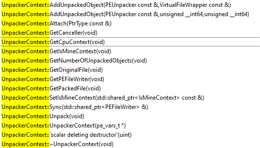
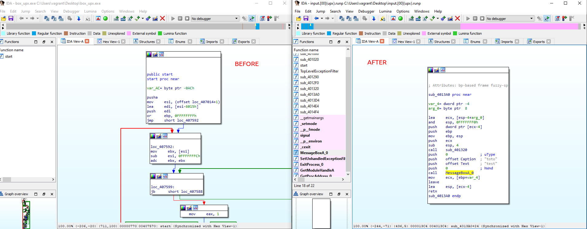
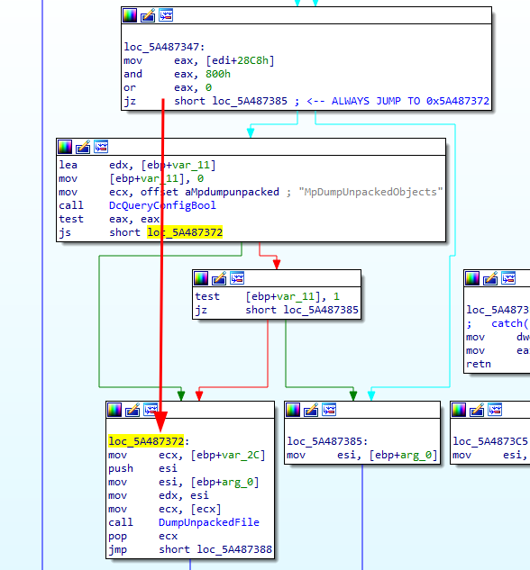
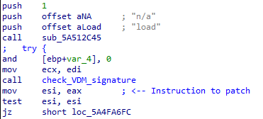

# Unpacking with Windows Defender

## TLDR

- Windows Defender implements some unpackers
- With a few patches, unpackers' output can be retrieved
- This repository explains how to do it, with additional patches for `loadlibrary`
- **This is not an universal unpacker**. At best, it helps with some commercial packers

## How it works

### Context

In order to have better results, Microsoft Windows Defender includes several unpackers for well-known, often commercial, packers.

These unpackers are runs in the same spirit than archive-related plugins:

1. Detects whether a known archive format or packer is used
2. Extract / unpack the target if it is supported
3. Go to 1.

These parsers are a good attack surface and devastating vulnerabilities[^CVE-2021-1647] have been found before.
The exploit found ITW actually use this mechanism: the analyzed PE first massages the heap, then drop (while being emulated) a PE on the virtual disk. This PE is packed with "AsProtect", which trigger the aforementioned unpacking mechanism (and the associated vulnerability).

### Idea

The basic idea is to hook into Defender to get back the unpacked binaries during the analysis process.
That way:

- The unpackers are actually "supported" by Microsoft, or at least kept up-to-date with their needs
- We can unpack them on several platform, including Linux (thanks to the amazing @taviso `loadlibrary` project[^loadlibrary])
- The resulting PE are actually well rebuilt -- some of them even run correctly

### Implementation

Symbols are unfortunately no more distributed for `mpengine.dll`. As a result, I'm using an old version[^oldmpengine] with symbols and lift them to newer versions using BinDiff or Diaphora.

Looking for unpacker implementation, several functions sound promising:


We found what we would expect from an unpacker: OEP (*Original Entry Point*) finding, import rebuilding, etc.

These unpackers uses a common class: `UnpackerContext`, as shown below:



Following the flow (either using a live debugger or an execution trace), we end on `UfsHelpers::QueueVo` which:

1. Looks for some current state configuration
1. Looks for the `MpDumpUnpackedObjects` configuration's boolean using `DcQueryConfigBool`
1. If everything is set, call `DumpUnpackedFile`

`DumpUnpackedFile` will then looks for the environment variable `UNPACK_DIR` to build the path to dump the unpacked file. This is our chance!

### Making an unpacker

So, the strategy is quite simple:

- patch the check in `UfsHelpers::QueueVo` to always call `DumpUnpackedFile`
- patch `loadlibrary` to set an environment variable `UNPACK_DIR`

```diff
--- a/peloader/winapi/Environment.c
+++ b/peloader/winapi/Environment.c
@@ -49,6 +49,10 @@ STATIC DWORD WINAPI GetEnvironmentVariableW(PWCHAR lpName, PVOID lpBuffer, DWORD
         memcpy(lpBuffer, L"1", sizeof(L"1"));
     } else if (strcmp(AnsiName, "MP_METASTORE_DISABLE") == 0) {
         memcpy(lpBuffer, L"1", sizeof(L"1"));
+    } else if (strcmp(AnsiName, "UNPACK_DIR") == 0) {
+        memcpy(lpBuffer, L"/tmp/unpack", sizeof(L"/tmp/unpack"));
```

And... that's all!

```bash
# Create the output directory
$ mkdir /tmp/unpack
# Unpack an UPX file
$ ./mpclient box_upx.exe
EngineScanCallback(): Scanning input
EngineScanCallback(): Scanning input->(UPX)
# Inspect the resulting file
$ file /tmp/unpack/input.\[00\]\(upx\).runp 
/tmp/unpack/input.[00](upx).runp: PE32 executable (console) Intel 80386 (stripped to external PDB), for MS Windows, UPX compressed
```



Even if is it a quite simple packer, the resulting binary is even working!

## Updating to 2024

While this is a work I've done around 2019, I expected it to continue working on recent version. The version I used is packaged into the *AntiMalware Definition Update* v1.409.399 from the 20 april 2024[^newmpengine].

Unfortunately, at the time of writing, `loadlibrary` is no longer able to run `mpengine.dll`. Indeed:

- Windows Defender has changed its inner working. In particular, additional checks on the VDM[^vdm] files have been added, as suspected by @taviso [^loadlibrary-issue]. Additionally, issues have since been fixed regarding the signature of these files (such as CVE-2023-24934[^blackhat])
- Several API which are now called by the newer versions are not hooked / emulated

### API hooks

In `peloader/pe_linker.c`, `loadlibrary` replaces imports by custom functions.
To quickly obtained the name of the target DLL and export, I first replaced the default hook with customized ones:

```C
+void unknown_symbol_stub_ADVAPI32_dll_RegDeleteKeyW(void)
+{
+    warnx("Unknown symbol: ADVAPI32.dll:RegDeleteKeyW");
+    __debugbreak();
+}
+void unknown_symbol_stub_ADVAPI32_dll_CreateRestrictedToken(void)
+{
+    warnx("Unknown symbol: ADVAPI32.dll:CreateRestrictedToken");
+    __debugbreak();
+}
...
+if (strcmp(dll, "ADVAPI32.dll") == 0) {
+    if (strcmp(symname, "RegDeleteKeyW") == 0) {
+        address_tbl[i] = (ULONG) unknown_symbol_stub_ADVAPI32_dll_RegDeleteKeyW;
+    }
+    if (strcmp(symname, "CreateRestrictedToken") == 0) {
+        address_tbl[i] = (ULONG) unknown_symbol_stub_ADVAPI32_dll_CreateRestrictedToken;
+    }
...
```

Then, I implemented several of them. This is more a time consuming work than a difficult one (and very similar to the implementation of hooks in Miasm or Qilling):

1. Run `./mpclient`
1. On unknown symbol, add the corresponding dummy fake function to `loadlibrary`
1. If needed, use the aforementioned `mpengine.dll` (with imported symbol) to understand what changes are actually expected by the caller

The patch [run_recent.patch](./run_recent.patch) contains these implementations. It has not yet been proposed to the main `loadlibrary` repository as it is both dirty and in some case crash the emulation.
From what I understand, there is an issue in the SEH handler set in the LUA engine[^lua] which might result than a badly emulated API.

But as the LUA checks happen *after* the unpacking process, this is enough for our purposes.

### Passing VDM signature checks

The VDM signatures are checked against certificate which are expected to be in the *Certificate Store*.
My first attempts was to emulate that store. It worked for some of the checks, but I got issues while trying to emulate the *PCA 2010* certificate -- mainly because a quick analysis was not enough to understand where the certificate is actually obtained on a real system.

As a result, and as we are already patching the binary to dump the PE objects, I ended up patching the certificate checks.

## Test results

I've got my hands on a collection of "UnPackme" challenges.
Unfortunately, there are quite old and I don't have an Internet link to them, but one can find their hash in the corresponding result file.

| MpEngine version | Packed binary (#) | Families (#) | Family with at least one unpacked file (#) | Family with all unpacked file (#)
|-|-|-|-|-|
| 1.1.15100.1 | 434 | 166 | 74 | 58 | 
| 1.1.24030.4 | 434 | 166 | 67 | 51 |

The tests results are available in the [results][./results] directory.
Beware, there are highly approximates: the family detection is naive, the samples are olds, the resulting dumped binaries might not be well rebuilt, etc.

Still, some results are quite interesting to look at:

- Some of the family are detected but not always dumped. For instance, `Armadillo 1.x` is unpacked where `Armadillo 4` is detected but not unpacked. Additionally, it seems that `Armadillo` is detected as an archive more than a packer. Maybe addind more dump hook could lead to better results
- There is a `DynDrop` unpacker which seems to be a general one, not tight to a given family
- In the `Themida` family (`1.3.0.0/UnPackMe_Themida1.3.0.0.g.exe`), the dumped file is named `oreans32.sys`, which is actually the *Oreans x32 driver*, part of the packer

### FAQ

- **Does Microsoft continue to update its unpacker?**

Regarding the numbers above, it doesn't seem so.
But as mentioned, there are not to be trusted.

In addition, the emulation of the new engine is more buggy (see above), and the UnpackMe collection I use is quite old. As a result, it seems that some of the old signatures have been removed or changed, avoiding a correct unpacking.

- **Should I add this unpacking to my workflow?**

On one hand, it doesn't cost too much -- there are "supported" by Microsoft.
On the other hand, nowadays the trend is more about one-time custom packers (to avoid detection) than using commercial ones (except for games or binaries alike, but the packers involved are not supported by Defender).

## How to use

### Setup

1. Clone [loadlibrary](https://github.com/taviso/loadlibrary) and apply patches [unpack_dir.patch](./unpack_dir.patch) and [run_recent.patch](./run_recent.patch) (tested on commit `c40033b12`):

```bash
$ git clone https://github.com/taviso/loadlibrary
$ cd loadlibrary/
$ git apply /path/to/this/repo/unpack_dir.patch
$ git apply /path/to/this/repo/run_recent.patch
```

1. Follow the instructions in `loadlibrary` to get the Windows Defender updates and binary, and to compile `mpclient`

1. Force PE dump in `mpengine.dll`

    1. Looks for references to the string `MpDumpUnpackedObjects`
    1. 2 functions are using it:
        - a simple one doing a few initialization
        - a second one, actually calling the dumper. **This is the one interesting**
    1. Several configuration checks are made. We want to always dump, so we patch the condition before to always call the dumper. The script [patch_jump.py](./patch_jump.py) can be used for this purpose

    

1. (only for 2021+ version of `mpengine.dll`): Ignore the VDM signature checks in `mpengine.dll`

    1. Looks for the 1 reference to the string `Engine.Kernel.UntrustedVdm`
    1. Get the caller site
    1. Patch the return value, for instance by replacing it with `xor esi, esi`

    

1. Create the resulting directory

```bash
mkdir /tmp/unpack
```

### Usage

To use it, run `mpclient` on the target binary and look for dumps in `/tmp/unpack`:

```bash
$ ./mpclient box_upx.exe
EngineScanCallback(): Scanning input
EngineScanCallback(): Scanning input->(UPX)
# Inspect the resulting file ("->" in the message could indicates a successful dump)
$ file /tmp/unpack/input.\[00\]\(upx\).runp 
/tmp/unpack/input.[00](upx).runp: PE32 executable (console) Intel 80386 (stripped to external PDB), for MS Windows, UPX compressed
```


[^CVE-2021-1647]: https://googleprojectzero.github.io/0days-in-the-wild/0day-RCAs/2021/CVE-2021-1647.html

[^loadlibrary]: https://github.com/taviso/loadlibrary

[^oldmpengine]: `7730486658277e24c383445071c881b22da8e548260c6701f77645a2232b5bed` (`mpengine.dll` version 1.1.15100.1), still accessible [here](https://msdl.microsoft.com/download/symbols/mpengine.dll/5B39CDCAb60000/mpengine.dll) at the time of writing

[^newmpengine]: `181e28791e16f6e39152c2d93e770efd4b2632b20000bd96f3cf8d73d38e25d8`(`mpengine.dll` version 1.1.24030.4 )

[^vdm]: https://github.com/commial/experiments/tree/master/windows-defender/VDM

[^loadlibrary-issue]: https://github.com/taviso/loadlibrary/issues/103#issuecomment-902310533

[^lua]: https://github.com/commial/experiments/tree/master/windows-defender/lua

[^blackhat]: https://www.blackhat.com/us-23/briefings/schedule/#defender-pretender-when-windows-defender-updates-become-a-security-risk-32706