# primaryGroupID - Security checks

## primaryGroupID?

[From the documentation](https://docs.microsoft.com/en-us/windows/win32/adschema/a-primarygroupid), the Active Directory `primaryGroupID` attribute:
> Contains the relative identifier (RID) for the primary group of the user.

An account with a `primaryGroupID` set to `N` is implicitly a member of the group with RID `N` (SID `S-1-5-21-...-N`). This is a well known backdoor and [it must be checked](https://www.cert.ssi.gouv.fr/uploads/guide-ad.html#primary_group_id_1000).

Note the account is actually not marked as member of the group in the AD (multi-valued attribute `members`). UI, such as `dsa.msc` (*Active Directory Users and Computers*) usually abstract this information, and display account in `members` and the ones with a `primaryGroupID` set to the group.

For instance:

1. The user `test`'s `primaryGroupID` is set to `ExampleGroup`:

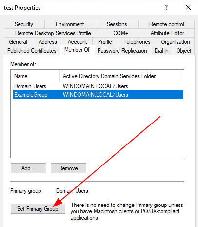

2. While the user is displayed as member of both `Domain Users` and `ExampleGroup`, it is in the AD actually only a member of `Domain Users`, with a `primaryGroupID` set to `ExampleGroup`:

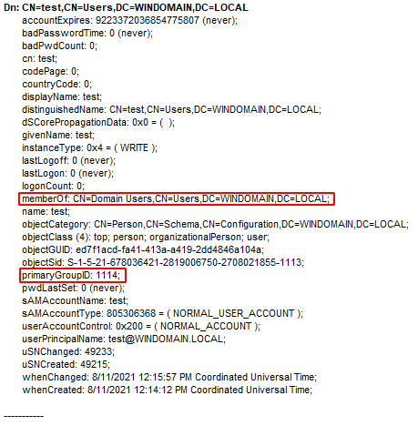

3. Remember `memberOf` is only a backlink; let's have a look at the group object, in the UI:

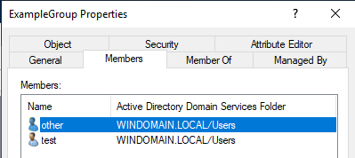

4. And in the AD:

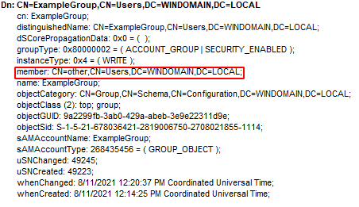

So, it looks like that if as an attacker I own an account, I can modify its attribute `primaryGroupID` and set it to 544, [making it domain administrator](https://docs.microsoft.com/en-us/windows/win32/secauthz/well-known-sids).

Is that right? If no, what's the magic behind?

## Required rights to modify the attribute primaryGroupID

In the schema, the `primaryGroupID` is defined in `CN=Primary-Group-ID,CN=Schema,CN=Configuration,DC=WINDOMAIN,DC=LOCAL`:

```js
adminDescription: Primary-Group-ID; 
adminDisplayName: Primary-Group-ID; 
attributeID: 1.2.840.113556.1.4.98; 
attributeSecurityGUID: 59ba2f42-79a2-11d0-9020-00c04fc2d3cf; 
attributeSyntax: 2.5.5.9 = ( INTEGER ); 
cn: Primary-Group-ID; 
distinguishedName: CN=Primary-Group-ID,CN=Schema,CN=Configuration,DC=WINDOMAIN,DC=LOCAL; 
dSCorePropagationData: 0x0 = (  ); 
instanceType: 0x4 = ( WRITE ); 
isMemberOfPartialAttributeSet: TRUE; 
isSingleValued: TRUE; 
lDAPDisplayName: primaryGroupID; 
name: Primary-Group-ID; 
objectCategory: CN=Attribute-Schema,CN=Schema,CN=Configuration,DC=WINDOMAIN,DC=LOCAL; 
objectClass (2): top; attributeSchema; 
objectGUID: c1fd5693-ce54-40b5-b229-888cc29d4acd; 
oMSyntax: 2 = ( INTEGER ); 
schemaFlagsEx: 1; 
schemaIDGUID: bf967a00-0de6-11d0-a285-00aa003049e2; 
searchFlags: 0x11 = ( INDEX | COPY ); 
showInAdvancedViewOnly: TRUE; 
systemFlags: 0x12 = ( ATTR_REQ_PARTIAL_SET_MEMBER | SCHEMA_BASE_OBJECT ); 
systemOnly: FALSE; 
uSNChanged: 966; 
uSNCreated: 966; 
whenChanged: 11/10/2017 7:25:44 PM Coordinated Universal Time; 
whenCreated: 11/10/2017 7:25:44 PM Coordinated Universal Time; 
```

If we look in the extended rights (`CN=Extended-Rights,CN=Configuration,DC=WINDOMAIN,DC=LOCAL`) for an entry with a `rightsGUID` set to the `primaryGroupID`'s `attributeSecurityGUID` (ie. `59ba2f42-79a2-11d0-9020-00c04fc2d3cf`), we found `CN=General-Information,CN=Extended-Rights,CN=Configuration,DC=WINDOMAIN,DC=LOCAL`:

```js
appliesTo (2): 4828CC14-1437-45bc-9B07-AD6F015E5F28; bf967aba-0de6-11d0-a285-00aa003049e2; 
cn: General-Information; 
displayName: General Information; 
distinguishedName: CN=General-Information,CN=Extended-Rights,CN=Configuration,DC=WINDOMAIN,DC=LOCAL; 
dSCorePropagationData: 0x0 = (  ); 
instanceType: 0x4 = ( WRITE ); 
localizationDisplayId: 8; 
name: General-Information; 
objectCategory: CN=Control-Access-Right,CN=Schema,CN=Configuration,DC=WINDOMAIN,DC=LOCAL; 
objectClass (2): top; controlAccessRight; 
objectGUID: 994b8595-d175-43a4-b340-478ecd22f234; 
rightsGuid: 59ba2f42-79a2-11d0-9020-00c04fc2d3cf; 
showInAdvancedViewOnly: TRUE; 
uSNChanged: 4192; 
uSNCreated: 4192; 
validAccesses: 48; 
whenChanged: 7/14/2021 2:19:19 PM Coordinated Universal Time; 
whenCreated: 7/14/2021 2:19:19 PM Coordinated Universal Time; 
```

The `validAccesses: 48` (`ACTR_DS_READ_PROP | ACTRL_DS_WRITE_PROP`) [indicates](https://docs.microsoft.com/en-us/windows/win32/ad/control-access-rights) that `General-Information` is [a property set](https://docs.microsoft.com/en-us/windows/win32/adschema/r-general-information).

So, long story short, if someone has the right to write on either `primaryGroupID` or `General-Information`, it can the modify `primaryGroupID` value.

1. Add `write property` on `WINDOMAIN\test General-Information` for `WINDOMAIN\other`:

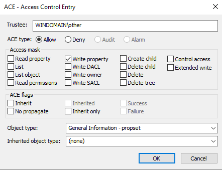

2. As `WINDOMAIN\other`, set the `primaryGroupID` of `WINDOMAIN\test`:

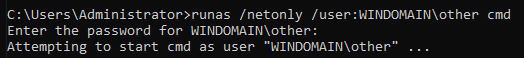

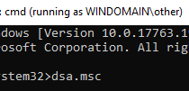

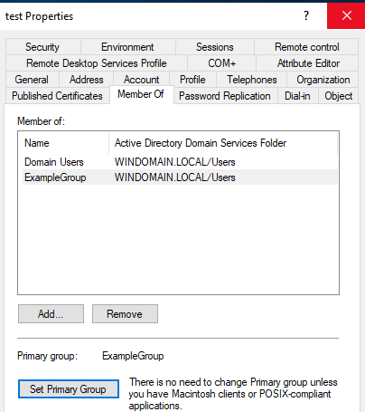

3. As expected, the `primaryGroupID` is changed

As an attacker owning the object, I can give myself that right. So is it game over?

## Write validation

Let's try to actually write `544` to the `primaryGroupID` of `WINDOMAIN\test`:

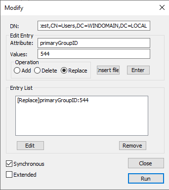

Result:

```
***Call Modify...
ldap_modify_s(ld, 'CN=test,CN=Users,DC=WINDOMAIN,DC=LOCAL',[1] attrs);
Error: Modify: Unwilling To Perform. <53>
Server error: 00000529: SvcErr: DSID-031A1236, problem 5003 (WILL_NOT_PERFORM), data 0

Error 0x529 The specified user account is not a member of the specified group account.
```

The update hopefully fails!

If from the AD point of view the write is authorized, there is one last place where it can be refused: in the actual AD implementation.

Let's have a look at the function handling writes to *information* attributes: `SampDsSetInformationUser` in `C:\Windows\System32\ntdsai.dll` (I'm using `ee24c940287aa96fb061feeced35fe1e3d41b8e3`):

```C
SampGetUlongFromAttrVal(v20, a4, v18, &attribute_asked);// Primary Group ID
if ( (UAC & 0x100000) != 0 && target_RID == 521 )// RODC
{
    primarygroupid_asked = 521;
    goto SHORTCUT_UPDT;
}
if ( (UAC & 0x100) != 0 && target_RID == 516 )// DC
{
    primarygroupid_asked = 516;
SHORTCUT_UPDT:
    new_primarygroupid = attribute_asked;
    ret_status = attribute_asked != primarygroupid_asked ? 0xC00002D0 : 0;
}
else
{
    new_primarygroupid = attribute_asked;
    ret_status = SampAssignPrimaryGroup(target, attribute_asked);
}
if ( ret_status < 0 )
    goto ERROR;
if ( new_primarygroupid != target_RID )
{
    target_RID = new_primarygroupid;
    keep_previous = 1;
    goto DO_UPDATE;
}
...
DO_UPDATE:
ret_status = SampReplaceUserV1aFixed(target, user_attrib);
...
if ( target_RID != previous_RID )
    ret_status = SampDsMaintainPrimaryGroupIdChange(target, target_RID, previous_RID, keep_previous);
```

After a special case for domain-controllers (DC) and read-only DC (RODC) explained below, `SampAssignPrimaryGroup` is called.

This function is implemented in `C:\Windows\System32\samsrv.dll` (`d630f03e9373758c0b50a18cb4ff7875d5faf5b5`):
```C
__int64 __fastcall SampAssignPrimaryGroup(__int64 user, int new_primarygroupid)
{
  __int64 v2; // rax
  int user_1; // edi
  int ret_value; // ebx
  __int64 idx; // rcx
  unsigned int group_cnt; // [rsp+30h] [rbp-88h] BYREF
  HLOCAL hMem; // [rsp+38h] [rbp-80h] BYREF
  char v10; // [rsp+40h] [rbp-78h] BYREF
  _DWORD v1afixed_attribs[20]; // [rsp+50h] [rbp-68h] BYREF

  v2 = *(unsigned int *)(user + 200);
  user_1 = user;
  group_cnt = 0;
  hMem = 0i64;
  if ( !*(_BYTE *)(0x550 * v2 + SampDefinedDomains + 0x538) )
    goto LABEL_16;
  ret_value = SampRetrieveUserV1aFixed(user, v1afixed_attribs);
  if ( ret_value >= 0 )
  {
    if ( v1afixed_attribs[13] != new_primarygroupid )
      ret_value = 0xC00000BB;                   // STATUS_NOT_SUPPORTED
    if ( ret_value >= 0 )
    {
LABEL_16:
      LOBYTE(new_primarygroupid) = 1;
      ret_value = SampRetrieveUserMembership(
                    user_1,
                    new_primarygroupid,         // = 1
                    (unsigned int)&group_cnt,
                    (unsigned int)&v10,
                    (__int64)&hMem);
      if ( ret_value >= 0 )
      {
        idx = 0i64;
        ret_value = 0xC0000068;                 //  STATUS_MEMBER_NOT_IN_GROUP
        if ( group_cnt )
        {
          while ( new_primarygroupid != *((_DWORD *)hMem + 2 * idx) )
          {
            idx = (unsigned int)(idx + 1);
            if ( (unsigned int)idx >= group_cnt )
              goto LABEL_12;
          }
          ret_value = 0;
        }
LABEL_12:
        LocalFree(hMem);
      }
    }
  }
  return (unsigned int)ret_value;
}
```

Basically, this function reflects the error obtained previously. The new `primaryGroupId` value **must be one of the current account's group**.

So, to set `WINDOMAIN\test`'s `primaryGroupID` to *Domain Admins*, the account must be already a member of *Domain Admins* (which requires the update of `members`, an attribute of the group, on which the attacker doesn't have rights).

Once checks have been made, the `primaryGroupId` is updated, and `SampDsMaintainPrimaryGroupIdChange` is called:

```C
__int64 __fastcall SampDsMaintainPrimaryGroupIdChange(__int64 target, __int64 new_primarygroupid, unsigned int previous_primarygroupid, char keep_previous)
{
  unsigned int ret_status; // ebx
  unsigned int ret_adduser2group; // eax

  ret_status = 0;
  if ( new_primarygroupid != previous_primarygroupid )
  {
    SampRemoveUserFromGroup(target, new_primarygroupid, target->RID);
    if ( keep_previous )
    {
      ret_adduser2group = SampAddUserToGroup(target, previous_primarygroupid, target->RID);
      if ( ret_adduser2group + 0x3FFFFF9A <= 1 ) // NT_STATUS_NO_SUCH_GROUP | NT_STATUS_MEMBER_IN_GROUP
        ret_adduser2group = 0;
      ret_status = ret_adduser2group;
    }
  }
  return ret_status;
}
```

Note: `if ( ret_adduser2group + 0x3FFFFF9A <= 1 )` is a compiler optimization. Note that `0x3fffff9a + 0xc0000066 = 0`, so the unsigned check corresponds to `ret_adduser2group in [NT_STATUS_NO_SUCH_GROUP=0xc0000066, NT_STATUS_MEMBER_IN_GROUP=0xc0000067]`.

So, in addition to setting the `primaryGroupID`, the code also:

* remove the account from the new `primaryGroupID`
* add the account to the previous `primaryGroupID`

From what we've seen at the beginning, this is an expected behavior. Indeed, group membership provided by `primaryGroupID` is implicit. This update keeps it coherent.

### DC, RODC special case

Special checks are made for DC and RODC:

* If `USER_SERVER_TRUST_ACCOUNT=0x100` flag is set (meaning the object is a DC, from [[MS-SAMR]](https://docs.microsoft.com/en-us/openspecs/windows_protocols/ms-samr/b10cfda1-f24f-441b-8f43-80cb93e786ec)), the only accepted `primaryGroupID` is `DOMAIN_DOMAIN_CONTROLLERS=516` (from [[MS-DTYP]](https://docs.microsoft.com/en-us/openspecs/windows_protocols/ms-dtyp/81d92bba-d22b-4a8c-908a-554ab29148ab))
* If `USER_PARTIAL_SECRETS_ACCOUNT=0x100000` flag is set (meaning the object is a RODC), the only accepted `primaryGroupID` is `READONLY_DOMAIN_CONTROLLERS=521`

Indeed, if we try to changes this value for a DC, we get:
```
***Call Modify...
ldap_modify_s(ld, 'CN=DC,OU=Domain Controllers,DC=WINDOMAIN,DC=LOCAL',[1] attrs);
Error: Modify: Unwilling To Perform. <53>
Server error: 0000213A: SvcErr: DSID-031A1236, problem 5003 (WILL_NOT_PERFORM), data 0

Error 0x213A Cannot change the primary group ID of a domain controller account.
```

So, when this value is actually changed?

If we look for `521` and `516` values in `samsrv.dll`, looking for link with `primaryGroupID`, we end on `SampDefaultPrimaryGroup`:
```C
__int64 __fastcall SampDefaultPrimaryGroup(__int64 target, int UAC)
{
  bool v2; // cl
  __int64 result; // rax

  v2 = (*(_BYTE *)(target + 192) & 2) != 0;
  if ( (UAC & 0x80u) != 0 && v2 )               // USER_WORKSTATION_TRUST_ACCOUNT
    result = (UAC & 0x100000) != 0 ? 521 : 515; // USER_PARTIAL_SECRETS_ACCOUNT ? READONLY_DOMAIN_CONTROLLERS : DOMAIN_COMPUTERS
  else
    result = (v2 & _bittest(&UAC, 8u)) != 0 ? 516 : 513;// USER_SERVER_TRUST_ACCOUNT ? DOMAIN_DOMAIN_CONTROLLERS : DOMAIN_USERS
  return result;
}
```

This function is called from `SampSetUserAccountControl`, so it seems to be updated on UserAccountControl update.

Let's try it:

1. Initial state: `TEST$` is a normal computer account

```js
CN=TEST,CN=Computers,DC=WINDOMAIN,DC=LOCAL:
   primaryGroupID: 515 = ( GROUP_RID_COMPUTERS ); 
   userAccountControl: 0x1020 = ( PASSWD_NOTREQD | WORKSTATION_TRUST_ACCOUNT );
```

2. Let's update it's `userAccountControl` for a DC (`SERVER_TRUST_ACCOUNT=0x2000`) from [MSDN](https://docs.microsoft.com/en-us/troubleshoot/windows-server/identity/useraccountcontrol-manipulate-account-properties):

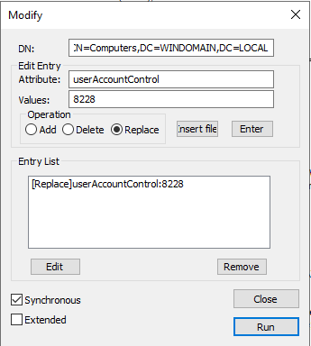

3. As a result, the primaryGroupID has changed!

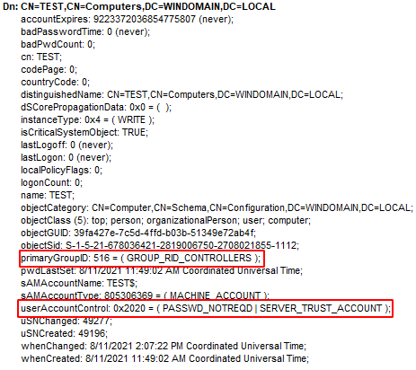

## Modifying the primaryGroupID

What if one wants to actually modify the `primaryGroupID` without all of these restrictions? (Let's say it is only for testing purposes)

Well, one can either:

* Perform a live modification on a running DC, by injecting himself in `lsass.exe`
* Update `ntds.dit` offline, for instance with [DSInternals::Set-ADDBPrimaryGroup](https://github.com/MichaelGrafnetter/DSInternals/blob/master/Documentation/PowerShell/Set-ADDBPrimaryGroup.md#set-addbprimarygroup)
* Force the change on a compliant DC, and asked for a replication, for instance using [DCShadow](https://www.dcshadow.com/)

Here is what the result looks like:

* in the AD:

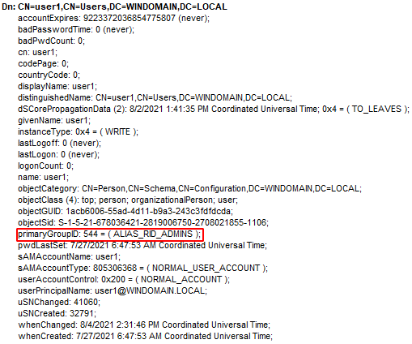

* in the UI (`dsa.msc`), on the user:

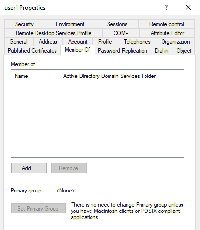

* but it is still displayed in `Administrators` members:

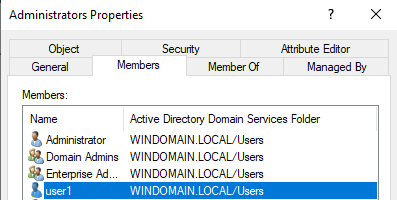
